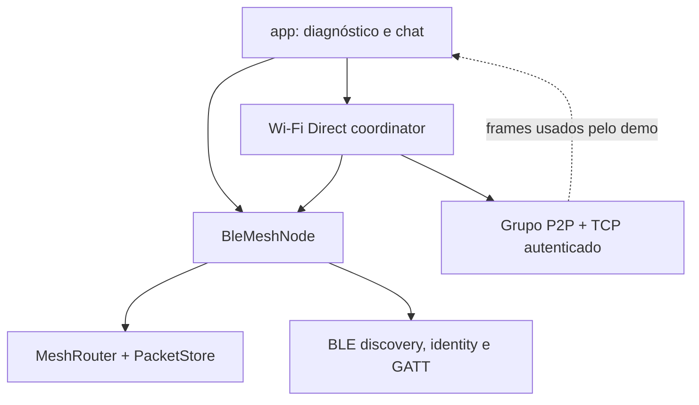
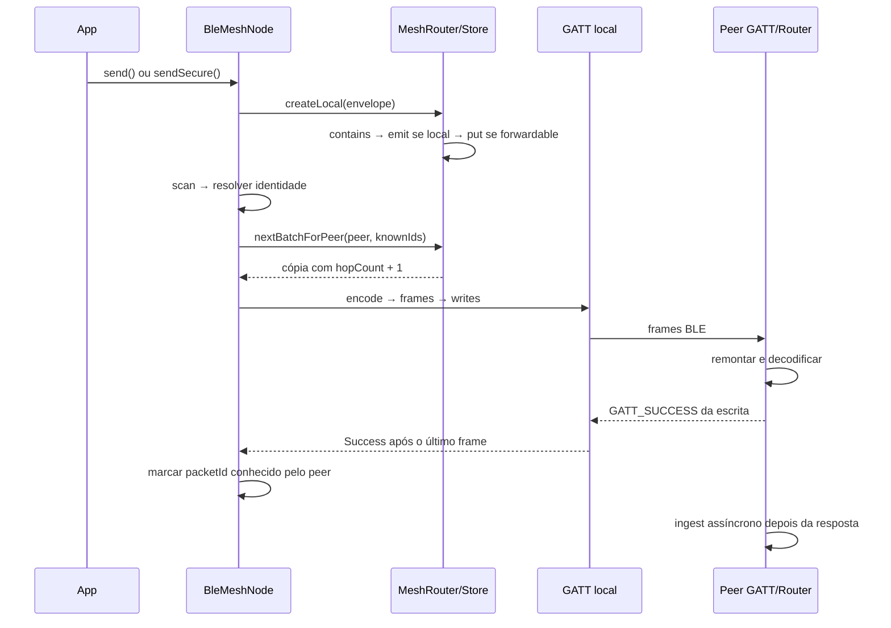
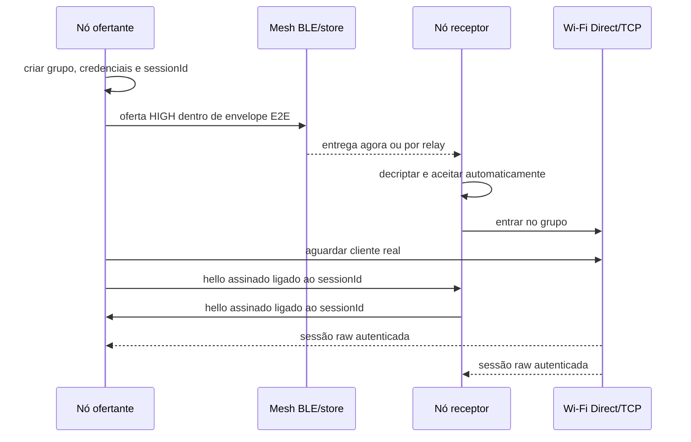
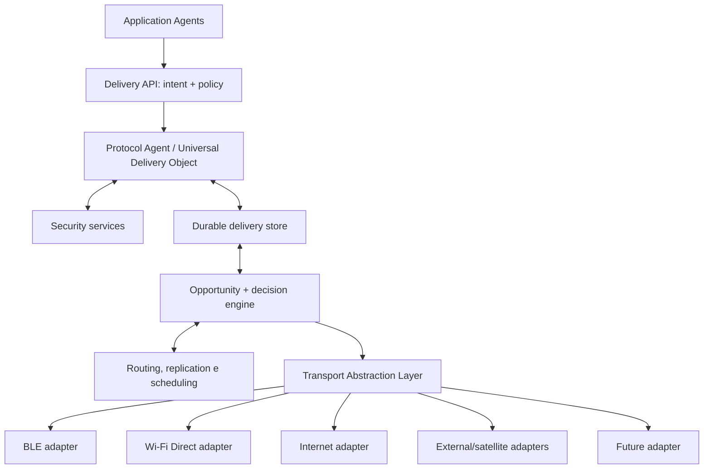
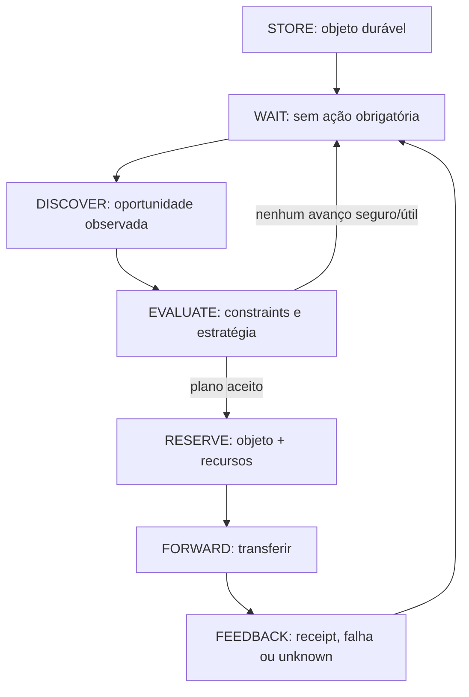
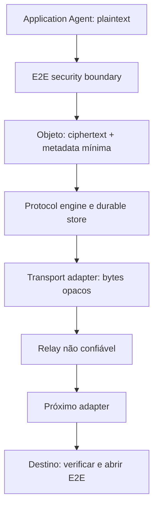
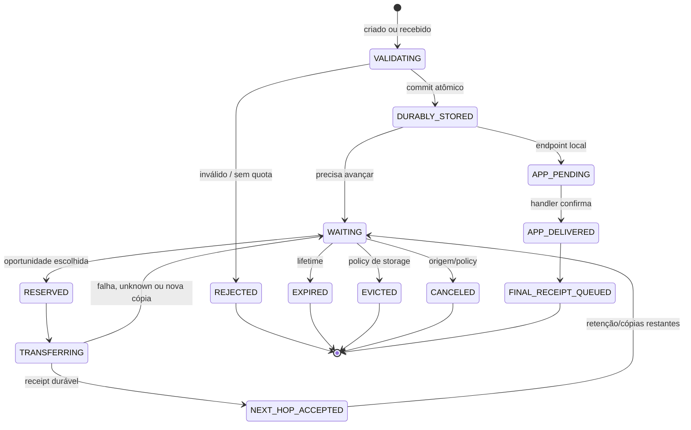
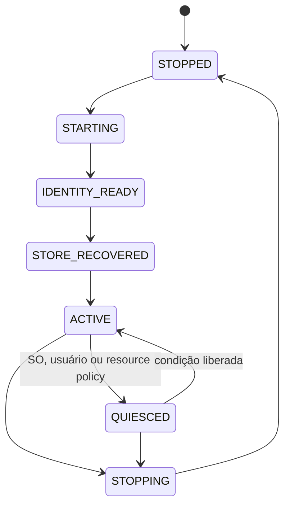

# OpenMesh Architecture v1

| Campo | Valor |
|---|---|
| Estado | Proposta arquitetural; nenhuma alteração estrutural de runtime está incluída neste documento |
| Auditoria-base | `main@df2dcca20d697cb77bed790d924fe940bd25aaf0` (`2026-08-19`) |
| Data da revisão | 2026-08-26 |
| Fonte de verdade | Código no commit acima; README e documentos de validação foram tratados como evidência secundária |

## Decisão executiva

O OpenMesh atual é um protótipo Android coerente de **store-and-forward seguro sobre BLE**, com uma primitiva experimental de upgrade para Wi-Fi Direct. Ele ainda não é uma camada universal de entrega: a API, o runtime, a descoberta, a política de reenvio e o lifecycle estão concentrados em `BleMeshNode`; não existe contrato geral de transporte, modelo de oportunidade, recibo de aceitação durável, reconciliação persistente ou seleção entre meios.

A missão proposta está correta, mas não é um paradigma novo em si. Ela coincide em grande parte com DTN, com o Bundle Protocol v7 (BPv7) e com a noção de *convergence-layer adapter*. A recomendação é **não criar agora um protocolo universal proprietário**. A primeira ADR deve comparar e prototipar:

1. um perfil OpenMesh de BPv7 como formato canônico;
2. um modelo interno que seja mapeável sem perda para BPv7, mantendo o envelope v1 apenas como legado encapsulado.

A opção 1 é a preferência desta planta. Ela compra semântica já especificada para store-carry-forward, endpoint IDs, lifetime, fragmentação, bundle age, hop count, extension blocks e status reports. O diferencial defensável do OpenMesh pode surgir na execução Android: seleção explicável e energy-aware entre oportunidades heterogêneas, identidade self-certifying, experiência offline e gateways fáceis de incorporar. Isso é uma **hipótese de diferenciação**, não uma reivindicação de novidade técnica.

### Invariantes da arquitetura-alvo

- `deliver(destination, payload, policy)` aceita uma intenção; não escolhe rádio.
- “Aceito” significa gravado duravelmente. “Entregue” exige recibo final autenticado do endpoint de destino.
- A inexistência de oportunidade agora produz `WAITING`, não falha.
- O nó continua válido sem BLE, sem Internet e até sem qualquer adapter ativo.
- Um adapter move objetos opacos; não decide roteamento e não recebe plaintext nem chaves de aplicação.
- `EndpointId`, `NodeId` e endereço de transporte são identidades diferentes.
- Identidade criptográfica prova posse de chave; não prova nome humano, autorização ou honestidade.
- Links unidirecionais e transportes sem ACK são cidadãos de primeira classe.
- Toda entrada remota e todo consumo de rádio, memória, armazenamento e recibos têm limites.
- O wire format v1 nunca é reinterpretado nem alterado silenciosamente.

## Método e grau de evidência

A árvore inteira retornada pelo GitHub foi inspecionada sem truncamento: 57 blobs, incluindo fontes, manifests, builds, CI, testes e documentação. A distribuição atual é:

| Módulo | Arquivos | Linhas | Testes `@Test` | Papel observado |
|---|---:|---:|---:|---|
| `mesh-core` | 15 | 977 | 10 | Envelope v1, roteador, store contratual e criptografia |
| `mesh-android` | 21 | 3.148 | 3 | BLE, persistência, identidade Android, service e Wi-Fi Direct |
| `app` | 5 | 1.663 | 0 | Três Activities de diagnóstico/demo |

O workflow do commit auditado executou com sucesso `:mesh-core:testDebugUnitTest`, `:mesh-android:testDebugUnitTest`, `:mesh-android:assembleDebug` e `:app:assembleDebug`. Isso confirma compilação e os 13 testes unitários existentes, não comportamento em rádios reais. O repositório não inclui Gradle Wrapper; portanto, a compilação local reproduzível depende hoje do Gradle 9.5 instalado externamente. Os roteiros manuais de dois aparelhos são úteis, mas não equivalem a resultados automatizados ou telemetria anexada.

Foram encontrados drifts documentais concretos: o README ainda lista Wi-Fi Direct/Aware como “próximo trabalho”, embora haja uma implementação Wi-Fi Direct; e chama de “per-peer delivery memory” um conjunto que é somente memória de processo e registra sucesso de escrita GATT, não receipt do peer. O código foi adotado em ambos os casos.

Neste documento:

- **Confirmado**: observado diretamente no commit auditado.
- **Inferência**: consequência técnica do código, explicitamente identificada.
- **Alvo**: decisão proposta, ainda não implementada.
- **Hipótese**: precisa de experimento ou pesquisa adicional.

---

## 1. Visão do sistema atual

O caminho operacional real é BLE-first. `MeshEnvelope` define o objeto de rede; `MeshRouter` faz deduplicação por `packetId`, guarda objetos encaminháveis e oferece a todos os peers conhecidos uma cópia elegível. `BleMeshNode` junta esse núcleo ao Android, descobre dispositivos, resolve identidade por GATT, envia frames e executa retry fixo. O Wi-Fi Direct é negociado por uma mensagem E2E transportada pelo próprio nó BLE e entrega uma sessão TCP autenticada à Activity; essa sessão não realimenta o roteador.



O nome `MeshRouter` é mais amplo que o comportamento presente. **Confirmado:** ele não calcula uma rota nem avalia contatos; implementa encaminhamento epidêmico controlado por TTL, hop limit, anti-retorno imediato, prioridade e memória local de IDs por peer.

## 2. Mapa dos módulos existentes

### `mesh-core`

| Componente | Responsabilidade atual | Observação |
|---|---|---|
| `MeshEnvelope` / codec | Header, payload Base64, TTL absoluto, hops, prioridade e serialização binária posicional | Versão exata `1`; prioridade serializada por `ordinal` |
| `MeshRouter` | Ingestão, emissão local, dedup, persistência e seleção do próximo lote | Política de forwarding embutida |
| `PacketStore` | CRUD e purge de envelopes | Sem transação de ingestão, estado, recibos ou reserva |
| `InMemoryPacketStore` | Store de teste protegido por `Mutex` | `contains` e `put` continuam operações separadas |
| `MeshNodeId` | ID `om1-` a partir de digest de 16 bytes | ID versionado no prefixo, porém algoritmo fixo |
| `MeshCrypto` | P-256, ECDH, ECDSA, AES-GCM e derivação de ID | Uma mesma identidade EC serve assinatura e acordo |
| `SecureMeshMessage` | E2E unicast e AAD de metadados imutáveis | Relay vê routing header e ciphertext |
| `PeerIdentityProof` | Challenge-response de posse da chave privada | Challenge aleatório de 32 bytes e domínio v1 |

### `mesh-android`

| Área | Componentes | Responsabilidade atual |
|---|---|---|
| Identidade e confiança criptográfica | `AndroidMeshIdentityStore`, `VerifiedPeerKeyStore` | Proteção da chave privada em repouso e cache de chaves verificadas |
| BLE presence | `BleMeshAdvertiser`, `BleMeshScanner`, `MeshRadioGuard` | Anúncio do service UUID, scan e pré-condições do rádio |
| BLE identity | `BlePeerIdentityClient`, características do GATT server | Node ID, chave pública, challenge e proof |
| BLE data | `BleFrameCodec`, `BleMeshGattClient`, `BleMeshGattServer` | Fragmentação, escrita e remontagem de envelopes |
| Orquestração | `BleMeshNode`, `MeshNodeService` | Router, peers, retry, service em foreground e lifecycle BLE |
| Wi-Fi Direct | controller, coordinator, data channel, authenticator e guard | Grupo P2P, oferta E2E, TCP e hello assinado |
| Persistência | `SharedPreferencesPacketStore` | Envelope inteiro codificado por entrada |

### `app`

`GattDiagnosticActivity` é o launcher. `ChatActivity` e `MainActivity` repetem partes da criação do nó, coleta de eventos, decriptação e upgrade Wi-Fi. O módulo é adequadamente um laboratório manual, mas hoje também hospeda lifecycle que deveria pertencer ao runtime, especialmente o coordinator Wi-Fi Direct.

## 3. Responsabilidades atuais

As responsabilidades efetivamente presentes são:

1. criar envelope plaintext ou E2E;
2. aceitar e reter uma cópia enquanto TTL/hops permitem;
3. emitir localmente unicast destinado ao nó ou broadcast;
4. anunciar presença BLE;
5. resolver um endereço BLE transitório para um `NodeId`;
6. verificar posse da chave, guardar a chave verificada e rejeitar conflito;
7. oferecer cada objeto elegível a peers BLE conhecidos;
8. remontar no peer e repetir o ciclo;
9. opcionalmente negociar um grupo Wi-Fi Direct e abrir TCP autenticado.

Não há responsabilidade implementada para entrega por Internet, catálogo de adapters, descoberta de gateways, contato futuro agendado, orçamento de cópias, recibo final, custody, reconciliação persistente ou controle de congestionamento.

## 4. Acoplamentos problemáticos

| Acoplamento confirmado | Efeito |
|---|---|
| `BleMeshNode` instancia router, store, guards, advertiser, scanner, identity client, GATT client/server, key store, retry e caches | BLE é simultaneamente runtime, política e transporte; outro meio não pode entrar simetricamente |
| `WifiDirectUpgradeCoordinator` depende de `BleMeshNode` e coleta `deliveries` | Wi-Fi Direct é um acessório do BLE, não um adapter do protocolo |
| `MeshNodeService` possui um `BleMeshNode` e só observa Bluetooth | O nó inteiro “para” quando BLE para, mesmo que outro transporte pudesse funcionar |
| `MeshRouter.nextBatchForPeer()` contém dedup, ordenação, anti-echo e mutação de hop | Política de routing, scheduler e transformação de protocolo não podem variar independentemente |
| `MeshEnvelope` mistura campos imutáveis, hop-mutáveis, payload, assinatura e wire codec | Evolução, segurança e interoperabilidade ficam presas ao mesmo tipo |
| `PacketStore` só entende envelopes | Não há onde persistir estado de lifecycle, tentativas, fragments, receipts, reservas ou tombstones separados |
| Activities criam/coordenam Wi-Fi Direct | Sessões desaparecem com a UI e três telas duplicam a orquestração |
| Eventos `Forwarded` representam apenas conclusão de escrita GATT | A API e a UI confundem resultado de link com resultado de entrega |

## 5. Limites arquiteturais atuais

O limite forte existente é entre Kotlin core e APIs Android, mas `mesh-core` ainda é um Android Library Module. Os limites conceituais que faltam são mais importantes que novos módulos Gradle:

- Application Agent versus Protocol Agent;
- objeto imutável versus estado local mutável;
- endpoint lógico versus nó criptográfico versus endereço de link;
- decisão de encaminhamento versus execução do transporte;
- observação local versus capability declarada remotamente;
- aceitação pelo próximo hop versus entrega final;
- identidade de chave versus confiança/autorização humana;
- lifecycle do nó versus lifecycle independente de cada adapter.

Não se recomenda explodir imediatamente o repositório em muitos módulos. Primeiro estabilize esses contratos em packages testáveis; extraia módulos de adapter somente quando dois adapters reais obedecerem ao mesmo SPI.

### Verificação e governança observadas

- Os 10 testes core cobrem round-trips criptográficos, identidade/proof e dois cenários de routing; os 3 testes Android cobrem apenas o codec da oferta Wi-Fi Direct.
- Não há teste de `BleFrameCodec`, GATT, store Android, concorrência/restart, data channel/auth Wi-Fi, limits adversariais ou instrumentation em dispositivo na árvore atual.
- CI compila bibliotecas e app, mas não executa lint, fuzz/property tests, instrumentation ou interop.
- Actions usam tags maiores (`@v4`) em vez de SHAs imutáveis. Isso é risco de supply chain menor que os defeitos de protocolo, mas deve entrar no hardening.
- `main` estava sem branch protection na auditoria. Antes da migração, exija CI e review para mudanças em codec, crypto, store e adapters.
- Não há licença concedida; o README reserva todos os direitos. Isso não bloqueia arquitetura interna, mas precisa ser decidido antes de interoperabilidade pública ou contribuições externas.

### Achados priorizados

| Prioridade | Achado | Motivo |
|---|---|---|
| P0 | Escrita GATT é apresentada como entrega | Pode levar a apagar/considerar entregue algo que o destino nunca persistiu |
| P0 | Ingestão/delivery não é transacional e inbox não é durável | Duplicação ou perda de observação após concorrência/process death |
| P0 | Assemblies, flooding e retries não têm quotas/policy adequadas | Memory, storage e battery DoS |
| P1 | Tamanho aceito pelo core excede em muito o máximo do GATT atual | Objetos válidos ficam permanentemente impossíveis de transportar |
| P1 | Wi-Fi Direct não está ligado ao router e tem ownership/concurrency frágeis | O segundo transporte não prova ainda a abstração desejada |
| P1 | Static ECDH, KDF ad hoc e chave multiuso | Sem forward secrecy, key separation ou evolução limpa |
| P1 | Codec v1 posicional/exato, `ordinal` no wire e relógio absoluto | Evolução incompatível e operação frágil sem clock confiável |
| P2 | README, UI e implementação divergem | Diagnóstico e decisões de arquitetura podem partir de premissas erradas |

## 6. Fluxo atual de um pacote



Consequências confirmadas/inferidas:

- A resposta GATT do último frame ocorre antes de se provar que o peer persistiu o objeto; o callback de ingestão é lançado assincronamente.
- `ChatActivity` transforma esse sucesso em “entregue ao peer por BLE”. Isso é semanticamente falso: no máximo houve aceitação das escritas pelo stack GATT remoto.
- A emissão da entrega local ocorre antes de `store.put`; `SharedFlow` tem `replay = 0`. Se não houver collector, a aplicação pode não observar a entrega, embora o envelope possa permanecer na store.
- `contains(packetId)` e `put(packet)` não são uma transação; ingestões concorrentes podem emitir a mesma entrega mais de uma vez.
- Um objeto final no limite exato de hops é emitido, mas não armazenado como tombstone porque `canForward()` é falso; ele pode ser entregue repetidamente.
- Não existe protocolo de inventário. `peerKnownPacketIds` é memória de processo, limpa integralmente acima de 2.048 IDs e atualizada após escrita de link.

A garantia atual é, portanto, **best-effort at-least-once sem recibo**, e nem essa semântica está formalizada na API.

## 7. Modelo atual de identidade e segurança

### O que está correto e deve ser preservado

- A identidade EC P-256 gera `nodeId = om1- + first128bits(SHA-256(X.509 public key))`.
- O peer prova posse da chave com challenge aleatório, assinatura com domínio e binding do `nodeId`.
- Uma chave conflitante para o mesmo ID é rejeitada; confiança humana é explicitamente separada.
- `SecureMeshMessage` verifica que a chave do remetente deriva o `sourceNodeId`, verifica ECDSA e abre AES-GCM.
- AAD cobre versão, packet ID, source, destination, creation/expiration, max hops, prioridade e content type. `hopCount` e `lastHop` ficam fora, permitindo mutação legítima por relay.
- Relays não precisam conhecer o plaintext.

### Limitações confirmadas

| Tema | Situação atual | Consequência |
|---|---|---|
| Derivação de chave | ECDH estático seguido de `SHA-256(domain || secret)` | Sem HKDF, separação de contexto robusta, rotação ou forward secrecy |
| Uso da chave | A mesma chave P-256 de longo prazo assina e faz ECDH | Acoplamento de propósitos e migração criptográfica difícil |
| Tamanho do ID | Digest truncado a 128 bits | Segurança genérica de colisão de aproximadamente 64 bits; preimagem direcionada permanece ~128 bits |
| Rotação | Nova chave implica novo `nodeId` | Sem continuidade de identidade ou delegação de chaves |
| Replay | TTL, hop e dedup por ID | Sem tombstone durável separado, nonce/protocolo de receipt ou limite de timestamp futuro |
| Plaintext | `send()` cria envelope não assinado | Integridade/autenticidade só existem para `sendSecure()` |
| Admission | Router valida versão/expiração/ID duplicado, não identidade ou assinatura | Envelope forjado pode consumir store/rádio; até a assinatura E2E verificável só é checada no destino |
| Chave Android | EC privada exportável é cifrada por AES não exportável em Keystore | Boa proteção em repouso, mas a chave vira `String` no processo após abrir |
| Backup | `app` define `allowBackup=true` | Restore de preferences sem a wrapping key pode exigir reset explícito |

Identidade self-certifying **não é resistência a Sybil**: qualquer atacante pode gerar muitas chaves baratas. Ela prova consistência chave↔ID, não custo, reputação ou autorização.

Peers cuja posse não foi verificada ainda podem participar como relays no caminho atual. Isso preserva alcance e não revela o plaintext E2E, mas reforça a necessidade de admission/quotas: “pode transportar ciphertext” não significa “é confiável ou pode consumir recursos sem limite”.

## 8. Modelo atual de BLE

### Discovery e identidade

- O advertising legado contém somente o service UUID; o comentário e o código estão alinhados com o orçamento de 31 bytes.
- O scanner filtra o UUID e produz endereço, RSSI e instante. `BleMeshNode` usa apenas o endereço; RSSI e recência não entram em decisão.
- Um primeiro GATT resolve 16 bytes de ID, chave pública, challenge e proof. O cliente pede MTU 247 para esse fluxo.
- A identidade resolvida por endereço é mantida em memória sem expiração; nova prova não é feita enquanto o cache da instância sobreviver.

### Dados

- Um segundo GATT é aberto por envelope.
- O cliente de dados usa deliberadamente ATT MTU 23. O valor útil é 20 bytes; com header OpenMesh de 13 bytes, restam **7 bytes por frame**.
- O contador de frames é `UShort`; logo o máximo teórico do envelope codificado nesse caminho é `65.535 × 7 = 458.745 bytes`.
- O core aceita payload seguro de até 16 MiB, antes do overhead Base64. Assim, a API consegue criar objetos que o único transporte integrado nunca consegue enviar.
- O assembler é indexado apenas por `transferId`, não por peer, guarda chunks inteiros em RAM, expira em 60 s e não limita assemblies simultâneos ou bytes por peer. É uma superfície de memory/battery DoS.
- Não há resume, janela, congestion control, hash de fragmentos ou acceptance ACK do envelope completo.
- `addService()` e `startAdvertising()` são operações assíncronas, mas o startup do nó considera apenas a aceitação imediata das chamadas; não aguarda `onServiceAdded`/`onStartSuccess`. O scanner também não trata `onScanFailed`.

### Operação

O scan e advertising usam modo balanceado; retry de peers conhecidos roda a cada 4 s. Não há backoff exponencial, jitter, orçamento por bateria, expiração da tabela de peers ou circuit breaker. Falhas removem o mapeamento de endereço; sucesso marca o ID em memória.

## 9. Modelo atual do upgrade Wi-Fi Direct



Pontos fortes:

- credenciais temporárias aleatórias são protegidas pelo envelope E2E;
- o owner só declara grupo conectado após cliente real;
- ambos os lados provam a identidade OpenMesh já verificada, ligada ao `sessionId`;
- há fallback operacional: falha do upgrade não apaga a fila BLE.

Limites e defeitos arquiteturais:

- `WifiDirectSocketSession` possui `sendEnvelope()`/`onEnvelope()`, mas o coordinator nunca a liga ao router; o demo envia frames `FAST_TEST`. Não é ainda um transporte de objetos.
- Uma oferta pode ser store-and-forward por relay, mas Wi-Fi Direct exige contato físico contemporâneo entre ofertante e destinatário. Com TTL de 90 s, esse control object só faz sentido numa oportunidade direta já observada.
- `Connected` significa grupo P2P formado, não sessão TCP autenticada; os eventos distinguem depois `SessionOpened`, mas o tipo de retorno induz erro.
- O server TCP mantém o primeiro callback enquanto já estiver aberto. Ofertas simultâneas posteriores podem autenticar usando `sessionId`/peer esperados da primeira oferta.
- Não há tie-break de ofertas simultâneas, consentimento/política, rate limit ou limiar de energia/tamanho para aceitar o rádio caro.
- O hello assinado não inclui nonces efêmeros, papéis, transcript/channel binding ou acordo com forward secrecy.
- Após o hello, frames raw dependem de WPA/TCP; somente envelopes E2E preservam a confidencialidade de aplicação.
- Um comprimento remoto de até 32 MiB provoca alocação integral; há limite, mas ele é alto e sem backpressure por peer.
- O coordinator vive em Activity, não no foreground service.
- O group controller só é suportado em Android Q+, embora o módulo declare minSdk 26.

## 10. O que já pode ser reutilizado

| Ativo | Reutilização recomendada |
|---|---|
| Conceito de AAD relay-safe | Preservar como invariante e mapear para security blocks/immutable fields do protocolo-alvo |
| `PeerIdentityProof` | Manter como mecanismo legado BLE v1; generalizar atrás de `PeerAuthenticator` |
| `VerifiedPeerKeyStore` | Migrar dados para um `IdentityRepository`; preservar conflito explícito e separação de confiança humana |
| `MeshEnvelope`/codec | Congelar como `LegacyV1Envelope`/`LegacyV1Codec`; nunca expandir posicionalmente |
| `MeshRouter` e testes | Usar como baseline comportamental e estratégia `ControlledEpidemicV1`, não como engine final |
| BLE advertiser/scanner/GATT | Envolver como primeiro `TransportAdapter`, corrigindo limites e ACK em etapas |
| Wi-Fi Direct group/data/auth | Reutilizar como primitivas internas de um adapter após corrigir concorrência e sessão |
| `MeshRadioGuard` e foreground service | Evoluir para resource/lifecycle hosts multi-adapter |
| App de diagnóstico | Transformar em harness de observabilidade sem fazê-lo controlar o runtime |

## 11. O que precisa ser abstraído

Os primeiros seams, ainda dentro dos três módulos atuais, devem ser:

- `DeliveryService`: entrada pública e observação de lifecycle;
- `DeliveryObjectCodec`: v1 legado e futuro BPv7/OpenMesh profile;
- `DeliveryStore`: ingestão transacional, estado, fragments, receipts e tombstones;
- `IdentityService`, `KeyProvider`, `TrustPolicy` e `CryptoSuite` separados;
- `TransportAdapter`, `Opportunity`, `TransferSession` e `TransferResult`;
- `DiscoveryProvider` separado da transferência quando o meio assim exigir;
- `RoutingStrategy`, `ReplicationPolicy`, `QueueScheduler` e `AdmissionPolicy`;
- `ReconciliationProtocol` e `ReceiptService`;
- `NodeResourceMonitor` e `EnergyPolicy`;
- `GatewayReachabilityResolver` e `ContactPlanProvider`.

---

## 12. Arquitetura-alvo



### API de aplicação

Contrato conceitual:

```text
deliver(destination: EndpointId, payload: Payload, policy: DeliveryPolicy): DeliveryHandle
```

`DeliveryHandle` deve ser retornado somente após commit durável e expor um stream persistente de estados. A aplicação escolhe semântica — deadline/lifetime, prioridade, custo máximo, receipt desejado, confiança mínima, tolerância a replicação e metadata policy — não BLE, Wi-Fi ou Internet.

### Identificadores distintos

| Tipo | Significado | Exemplo de uso |
|---|---|---|
| `EndpointId` | Destino lógico de aplicação/serviço | pessoa, inbox, grupo, serviço de gateway |
| `NodeId` | Identidade criptográfica de um nó BP/OpenMesh | autenticar peer e emitir receipts |
| `TransportAddress` | Endereço efêmero dentro de um adapter | BLE MAC resolvido, IP/porta, radio address |
| `DeliveryId` | Identidade estável da intenção/objeto | dedup, lifecycle e receipts |
| `ContentDigest` | Digest do conteúdo imutável | integridade e reconciliação, não semântica de entrega |

O destino atual é um `NodeId`. Isso pode continuar como endpoint singleton de compatibilidade, mas não pode ser a única forma de endereçamento futuro.

### Organização lógica versus módulos Gradle

Primeiro, organize packages/contratos em `mesh-core` e `mesh-android`. Depois de dois adapters funcionais, extraia opcionalmente:

```text
mesh-core/{api,protocol,security,store,engine,routing,transport-spi}
mesh-android/{runtime,persistence,resource-policy,adapter-ble,adapter-wifi-direct}
transport-internet
transport-<future>
gateway-<kind>
app
```

O core não deve depender de Android, sockets, BLE, Wi-Fi ou de uma implementação criptográfica concreta.

## 13. Universal Envelope / Delivery Object

### Decisão recomendada

Usar **BPv7 (RFC 9171) como base canônica**, com um perfil OpenMesh estreito e extension blocks registrados/documentados. BPv7 já define o overlay store-and-forward, Bundle Protocol Agent, Application Agent, Convergence-Layer Adapter, endpoint IDs, lifetime, fragmentação, Previous Node, Bundle Age, Hop Count e status reports. Inventar equivalentes reduziria interoperabilidade e repetiria anos de trabalho.

O perfil deve considerar as atualizações normativas do BPv7, inclusive [RFC 9713](https://www.rfc-editor.org/info/rfc9713/) e [RFC 9758](https://www.rfc-editor.org/info/rfc9758/), em vez de congelar uma leitura isolada do RFC 9171.

| Opção | Vantagem | Risco | Posição desta planta |
|---|---|---|---|
| BPv7 canônico | Semântica e interoperabilidade padronizadas | Complexidade e overhead em BLE precisam ser medidos | Preferida, condicionada ao spike |
| Modelo interno lossless para BPv7 | Pode otimizar API/store sem expor BP à aplicação | Dois modelos podem divergir | Fallback aceitável com conformance tests |
| Protocolo OpenMesh v2 independente | Controle total do wire | Repete DTN, cria ilha e amplia superfície criptográfica | Não recomendado sem evidência forte |

O objeto lógico OpenMesh deve se dividir em:

1. **identidade, conteúdo e blocks protegidos fim a fim**, imutáveis sob essa proteção;
2. **canonical extension blocks processáveis**, com regra explícita para mutação por hop e nova serialização da instância de saída;
3. **estado local mutável**, nunca confundido com bytes protegidos/assinados;
4. **policy sidecar local**, que não é automaticamente revelado ou confiado por outros nós.

`DeliveryPolicy` também precisa ser partida: semântica necessária ao destino/rede — lifetime, classe, receipt request e requisitos E2E — vira campo/block protegido no objeto; preferências do operador local — bateria mínima, custo financeiro, peers permitidos e logging — permanecem sidecar. Encaminhar toda a policy vazaria informação e permitiria que um remetente comandasse recursos alheios.

| Necessidade OpenMesh | Mapeamento recomendado |
|---|---|
| Origem/destino lógico | BP source/destination EIDs |
| Lifetime | BP creation timestamp + lifetime; Bundle Age quando relógio não for confiável |
| Saltos | BP Hop Count block |
| Último nó | BP Previous Node block |
| Payload | BP payload block; ciphertext quando a política exigir E2E |
| Fragmentação | Fragmentação BP e/ou segmentação resumível do CLA, decididas em camadas distintas |
| Delivery status | Bundle Status Reports, perfilados e rate-limited |
| Integridade/confidencialidade | BPSec (RFC 9172/9173) ou encapsulamento E2E v1 durante migração |
| ID OpenMesh | Bundle identity normativa + extension/app ID de 256 bits quando necessário |
| Copy budget | Extension block OpenMesh opcional e autenticado, ou estado local quando não precisar viajar |

### Regras de extensibilidade

- CBOR determinístico/canônico conforme o perfil escolhido.
- Type IDs, namespace, versão e limites explícitos por block.
- Unknown optional block: preservar e encaminhar quando permitido.
- Unknown critical block: rejeitar ou gerar status conforme flags.
- Campos numéricos de wire usam códigos estáveis; nunca `enum.ordinal`.
- Nenhum campo de transporte no contrato de aplicação.
- Limites globais e por block antes de alocar memória.
- O payload pode ser stream/arquivo; não deve exigir Base64 nem materialização integral.

### Compatibilidade com v1

`MeshEnvelope` v1 permanece byte-for-byte. O v2 não tenta “corrigir” sua assinatura ou reserializar campos. Um gateway pode:

- decodificar v1 para estado interno enquanto preserva os bytes originais; ou
- encapsular o envelope v1 inteiro como payload de um bundle v2.

Encapsulamento é preferível quando uma tradução alteraria bytes assinados ou semântica de identidade.

## 14. Transport Abstraction Layer

O termo já conhecido em BPv7 é **Convergence-Layer Adapter (CLA)**. `TransportAdapter` pode ser o nome da API Kotlin, mas a documentação deve explicitar a equivalência.

Contrato conceitual mínimo:

```text
TransportAdapter
  descriptor(): AdapterDescriptor
  start(context): Flow<AdapterEvent>
  stop()
  opportunities(): Flow<Opportunity>
  open(opportunity, reservation): TransferSession

TransferSession
  send(objectRef, range/fragmentPlan): TransferResult
  receive(): Flow<InboundTransfer>
  reconcile(summary): ReconciliationResult
  close()
```

Regras:

- Adapter reporta fatos e medições; não seleciona objetos por conta própria.
- O engine entrega referência/stream opaco e um plano; o adapter não acessa plaintext.
- `TransferResult` usa semântica tipada: `LINK_WRITTEN`, `PEER_ACCEPTED_DURABLY`, `UNKNOWN`, `RETRYABLE_FAILURE`, `PERMANENT_FAILURE`.
- Adapter declara se consegue produzir cada nível de confirmação; ausência de ACK não torna o adapter inválido.
- Transferência deve suportar cancelamento, backpressure, deadline, progresso, resume quando disponível e limites por sessão.
- Descoberta e data plane podem ser meios distintos: BLE pode descobrir e Wi-Fi Direct transportar, mas a composição pertence ao engine.
- Um adapter de gateway/Internet não ganha confiança especial; ele é só outra oportunidade com reachability e policy próprias.

## 15. Capability Model

“Capacidade declarada pelo transporte” precisa ser refinada. Alcance, disponibilidade, throughput e confiabilidade não são constantes confiáveis do adapter. O modelo deve separar quatro fontes:

| Estrutura | Fonte | Confiança inicial | Vida útil | Exemplos |
|---|---|---|---|---|
| `AdapterDescriptor` | Código/configuração local | Alta | versão/lifecycle | unicast, broadcast, directionality, MTU, infra requerida |
| `LinkObservation` | Medição local | Alta, com incerteza | curta | RSSI, goodput, RTT, perdas, janela observada |
| `PeerAdvertisement` | Claim remoto assinado | Baixa até corroborar | expira | transports aceitos, gateway reachability, buffer oferecido |
| `NodeResourceContext` | SO/política local | Alta | imediata | bateria, charging, thermal, storage, metered/data saver |

Dimensões mínimas:

- identificador e versão do adapter;
- direção: inbound, outbound ou bidirecional;
- modos: unicast, multicast/broadcast, discovery;
- MTU, máximo de objeto, máximo de fragmento e streaming/resume;
- custo de setup, energia estimada por setup/byte/tempo e custo financeiro;
- latência, throughput, confiabilidade e duração/janela com intervalo de confiança;
- necessidade e tipo de infraestrutura;
- concorrência, half/full duplex e capacidade disponível estimada;
- autenticação de peer, confidencialidade/integridade do link, forward secrecy e confiança na infraestrutura como eixos separados;
- nível de ACK/receipt suportado;
- proveniência, momento da observação e expiração.

Nunca reduza “segurança do meio” a um escalar. Nunca trate claim assinado como claim verdadeiro: assinatura dá autoria. Medição local prevalece; claims são limitados, envelhecidos e sujeitos a policy.

## 16. Opportunity / Decision Engine

Uma `Opportunity` não é uma rota. É uma possibilidade efêmera de avançar bytes em uma direção, por um adapter, para um peer ou gateway, sob limites observados.

```text
Opportunity {
  opportunityId, adapterId, peerRef?, transportAddress,
  direction, observedAt, expectedEnd?, capacityEstimate?,
  linkObservation, peerAdvertisement?, securityProperties,
  confidence, provenance
}
```

O ciclo-alvo é:



### Pipeline de decisão

1. **Validar** objeto, policy, estado e deadline.
2. **Enumerar** ações candidatas: esperar, enviar ao destino, replicar a relay, transferir para gateway, iniciar upgrade, usar contato agendado, descartar.
3. **Filtrar constraints duras**: confiança, segurança, custo financeiro, directionality, tamanho/MTU, tempo restante, energia, quota e restrições Android.
4. **Consultar Routing Intelligence** para estimar utilidade do próximo hop e orçamento de cópias.
5. **Agendar** de forma justa entre objetos elegíveis.
6. **Reservar transacionalmente** objeto, bytes, energia estimada e sessão para impedir sends concorrentes duplicados.
7. **Executar** pelo adapter.
8. **Aplicar feedback** tipado e atualizar estado, métricas e histórico.

Não use inicialmente um único score ponderado opaco. Pesos escondem violações: uma conexão barata não pode compensar segurança insuficiente. Use primeiro filtros obrigatórios e, depois, ordenação lexicográfica explicável, por exemplo:

1. destino final autenticado;
2. cumprimento do deadline;
3. avanço previsto pela estratégia de routing;
4. risco de perda/replicação;
5. custo energético e financeiro;
6. throughput/latência e fairness.

Cada decisão deve produzir um `DecisionTrace` local, sem payload: candidatos rejeitados, regras aplicadas, ação escolhida e confiança. Isso é essencial para depuração e para provar que energy/security policy foi respeitada.

## 17. Routing Intelligence

O core não deve prometer um algoritmo universal. Redes sociais móveis, contatos aleatórios, gateways terrestres e satélites com janelas conhecidas exigem estratégias diferentes. O próprio RFC 9171 deixa cálculo de rota e população das bases de forwarding fora de seu escopo; adotar BPv7 não escolhe o routing pelo OpenMesh.

| Conhecimento disponível | Estratégia apropriada | Uso OpenMesh recomendado |
|---|---|---|
| Apenas contato atual | Direct Delivery | Baseline e modo de energia crítico |
| Nenhum histórico, pequena rede de teste | Epidemic controlado | Compatibilidade v1, nunca default sem quotas |
| Contatos oportunísticos, recursos limitados | Spray-and-Wait | Primeiro default v2, com copy budget explícito |
| Histórico de encontros útil | PRoPHET | Plugin posterior; métricas envelhecidas e resistentes a claims falsos |
| Filas/congestionamento e histórico mais rico | MaxProp-like | Pesquisa posterior, após receipts e store correto |
| Contatos determinísticos/agendados | CGR/SABR | Satélite, rádio agendado ou gateways com contact plan |

O primeiro planner v2 recomendado é simples: **Direct-First + Spray-and-Wait limitado**. Ele é previsível, testável e limita amplificação. PRoPHET só deve entrar quando traces reais demonstrarem periodicidade de encontros. CGR/SABR só deve ser ativado quando houver `ContactPlanProvider` autenticado/confiável.

Routing Intelligence deve separar:

- reachability de endpoint anunciada por gateways;
- probabilidade/utility de encontro;
- política de replicação e orçamento de cópias;
- ordem da fila e política de drop;
- plano de fragmentos por oportunidade;
- feedback de receipts e falhas.

Loop control exige mais que `lastHop`: dedup exato, hop count, previous node, copy budget e histórico de transferências. Um gateway nunca deve ser selecionado só porque declarou “Internet”; alcance anunciado é autenticado quanto à origem, expirável e corroborado por resultados.

## 18. Store-and-forward

O store é parte do protocolo, não um cache. O alvo é uma implementação transacional — no Android, provavelmente Room/SQLite — com bytes imutáveis separados de estado mutável.

| Registro lógico | Conteúdo |
|---|---|
| `objects` | conteúdo/blocks canônicos recebidos, digest, source/destination, lifetime e security metadata |
| `delivery_state` | estado local, policy sidecar, retention constraints, next evaluation |
| `fragments` | ranges presentes, hashes e checkpoint de resume |
| `reservations` | oportunidade/sessão que possui temporariamente uma tentativa |
| `attempts` | peer, adapter, instante, bytes, resultado tipado e backoff |
| `receipts` | receipts recebidos/emitidos e validação |
| `tombstones` | IDs vistos após remoção do payload |
| `peer_inventory` | conhecimento reconciliado, com versão e expiração |
| `encounters` | observações locais agregadas para routing |

### Semântica obrigatória

- Ingestão `validate + dedup + persist + state transition` é atômica.
- Só após commit o receiver envia `PEER_ACCEPTED_DURABLY`.
- Delivery local usa inbox durável; restart volta a oferecer objetos não confirmados pela aplicação.
- Payload, receipt e tombstone têm retenções diferentes.
- Reservas expiram e são recuperadas após crash.
- Objetos grandes são streamados; nenhuma API exige Base64 ou `ByteArray` integral.
- Quotas existem por origem, peer de entrada, classe, adapter e total.
- Eviction nunca remove silenciosamente item sob retention constraint; gera estado/razão auditável.
- Clock abstrato e Bundle Age evitam depender exclusivamente de relógios sincronizados.

Semântica de aplicação padrão: **at-least-once com handler idempotente**. “Exactly once” fim a fim não deve ser prometido; pode-se oferecer dedup durável na inbox e uma chave idempotente para aproximá-lo.

## 19. Arquitetura de ACK e receipts

O termo ACK deve ser proibido sem um nível explícito:

| Nível | Significado | Quem pode afirmar | Efeito local |
|---|---|---|---|
| `FRAME/LINK_WRITTEN` | Frame aceito pelo stack/link | Adapter local | Progresso apenas; não remove objeto |
| `NEXT_HOP_ACCEPTED` | Objeto completo validado e persistido pelo próximo nó | Próximo `NodeId` | Suprime retry para aquele peer; pode reduzir cópia conforme policy |
| `FORWARDED_STATUS` | Nó afirma ter encaminhado depois | Relay | Telemetria/reputação; não prova entrega |
| `FINAL_STORED` | BPA do destino armazenou para endpoint local | Nó destino | Pode satisfazer policy “chegou ao dispositivo” |
| `FINAL_DELIVERED` | Aplicação destino confirmou processamento/commit | Endpoint/nó destino autorizado | Único estado terminal positivo fim a fim |
| `DELETED/EXPIRED` | Cópia foi removida com razão | Nó que removeu | Diagnóstico; pode disparar estratégia alternativa |

Receipts precisam ser autenticados, deduplicáveis e ligados a `DeliveryId`, tipo, emissor, resultado, versão e proteção de replay. Quando há sessão bidirecional, `NEXT_HOP_ACCEPTED` pode voltar no próprio link; quando não há, ele é outro objeto DTN e pode chegar muito depois.

Limites fundamentais:

- Assinatura prova quem fez a afirmação, não que um relay realmente guardou ou encaminhou. Histórico/reputação e policy tratam mentira; criptografia sozinha não.
- Só o destino autorizado pode gerar um receipt final terminal.
- Receipts por hop e status reports vazam trajetória e amplificam tráfego. O default deve pedir o mínimo e aplicar rate limit/agregação.
- Custody transfer não deve ser confundido com status report. BPv7 não oferece a antiga custody do BPv6 como semântica core; qualquer extensão OpenMesh exige ADR própria.

## 20. Deduplicação e reconciliação

`DeliveryId` e `ContentDigest` devem permanecer distintos. O mesmo conteúdo pode ter destinos, deadlines, políticas ou significados diferentes; deduplicar só por hash de payload seria incorreto.

### Modelo recomendado

- ID de origem com pelo menos 256 bits aleatórios ou identidade BP normativa + extension ID OpenMesh.
- Tombstone exato para objetos finais, expirados ou evicted durante janela definida pela policy.
- Registro separado de cópias por peer e receipts; não apagar o conhecimento ao apagar payload.
- Ingestão atômica para eliminar race `contains → put`.
- Reconciliation por contato antes de payload grande: versões, ranges/IDs e capacidade disponível.
- Checkpoint e resume por ranges autenticados para contatos curtos.

Comece com inventário exato paginado e limites pequenos. Bloom filter, Golomb-coded set ou IBLT podem reduzir overhead depois, mas são **hints**: falso positivo de uma estrutura probabilística nunca pode ser a única razão para suprimir definitivamente uma entrega. Deve existir reparo exato periódico ou acionado por ausência de receipt.

## 21. Prioridade

Prioridade não é apenas um enum. A policy deve combinar:

- classe com wire code estável (`CONTROL`, `EMERGENCY`, `EXPEDITED`, `NORMAL`, `BULK`);
- deadline/lifetime;
- tamanho e custo restante;
- receipt necessário;
- copy budget e confiabilidade desejada;
- custo financeiro e energia permitidos.

`CONTROL` é reservada ao runtime e sujeita a autenticação/quota; aplicações não podem se promover livremente. `EMERGENCY` melhora admission e scheduling, mas não ignora validação, segurança, storage ou battery circuit breaker.

O scheduler deve usar weighted/deficit fair queuing com aging para evitar starvation. Dentro da mesma classe, deadline e tempo de criação orientam a ordem. Objetos grandes não podem bloquear indefinidamente objetos pequenos, nem objetos pequenos impedir para sempre o progresso de um fragmento grande já reservado.

## 22. Comportamento energy-aware

`NodeResourceContext` deve observar pelo menos bateria, charging, thermal state, storage pressure, app standby/background restrictions, metered network e data saver. A policy deriva modos operacionais:

| Modo | Discovery | Replicação | Upgrade de rádio |
|---|---|---|---|
| `CRITICAL` | sob demanda/janelas raras | direto apenas | bloqueado salvo policy autenticada |
| `CONSERVE` | duty cycle longo | copy budget mínimo | só ganho grande e deadline próximo |
| `BALANCED` | adaptativo | Spray-and-Wait limitado | se custo de setup for amortizado |
| `THROUGHPUT` | mais frequente, ainda limitado | policy normal | prefere meio de maior goodput |

Mecanismos obrigatórios:

- backoff exponencial com jitter por peer/adapter e circuit breaker;
- batching e reconciliação antes de abrir uma conexão por objeto;
- orçamento de scan/advertising/conexão e de bytes por período;
- estimativa de setup versus bytes pendentes e duração esperada do contato;
- Wi-Fi Direct somente acima de limiar medido, não por pedido unilateral remoto;
- cancelamento por thermal/battery e retomada durável;
- telemetria local de energia por resultado para recalibrar estimativas.

**Hipótese H1:** BLE-control + Wi-Fi-Direct-data economiza energia e reduz latency acima de certo volume. O limiar deve vir de benchmarks em aparelhos reais; não deve ser hardcoded por intuição.

## 23. Security boundaries



### Separação de chaves e serviços

O target deve ter `IdentityRoot`, chaves delegadas/rotacionáveis, `SigningKey`, `RecipientEncryptionKey` e credenciais efêmeras de sessão separados por propósito. O provider deve preferir chaves não exportáveis/hardware-backed quando a API Android permitir, sem quebrar minSdk silenciosamente.

Para `om2`, a recomendação inicial é um identificador versionado com digest de 256 bits ou multihash equivalente, sujeito à ADR-011. Como o advertising atual publica apenas o service UUID, alongar o ID não exige colocá-lo no pacote BLE de 31 bytes; ele pode continuar sendo resolvido no canal de identidade.

Não se deve “melhorar” a criptografia atual com uma nova construção caseira. A ADR de segurança deve escolher um perfil interoperável: BPSec e security contexts padronizados quando aplicáveis; KDF padrão; algoritmo/version negotiation autenticado; rotação e revogação. O E2E v1 pode permanecer encapsulado durante a transição.

### Threat model

| Ameaça | Situação atual | Controle-alvo |
|---|---|---|
| Sybil | IDs self-certifying baratos | admission, quotas por oportunidade/origem, trust/attestation opcional; não prometer solução criptográfica universal |
| Replay/preplay | ID+TTL e dedup acoplado ao payload | IDs fortes, validação temporal/bundle age, tombstones, nonces/counters de receipt |
| Flooding | Epidemic e store sem quota | validação antes de alocar, quotas, copy budget, congestion/admission policy |
| Battery exhaustion | scan balanceado e retry fixo 4 s | duty cycle, backoff+jitter, rate limit, orçamento e circuit breaker |
| Capability spoofing | ainda não há capability model | autoria, proveniência, expiry, clamp e medição local dominante |
| Loops | dedup, hop e `lastHop` | previous node, copy budget, transfer history e reconciliação |
| Amplification | cópia a todos os peers elegíveis | replicação limitada e receipts mínimos/agregados |
| ACK fraud | ACK fim a fim inexistente | receipts tipados; só destino termina; reputação para relay |
| Malicious relay | E2E protege conteúdo seguro | preservar E2E e immutable metadata; tolerar drop/delay, que não podem ser impedidos |
| Metadata leakage | source, destination, tempo, tamanho e hops visíveis | minimização, padding opcional, pseudônimos/encapsulamento futuro; declarar leakage residual |
| Memory/storage DoS | limites altos/desiguais e assembler sem quota | parsing incremental, limites antes de alocar, quota por peer/origem e eviction auditável |
| Downgrade | apenas versão exata v1 | highest-version pinning por peer autenticado e fallback explícito |

O sistema não consegue impedir um relay de descartar ou atrasar dados. A meta é confidencialidade/integridade, detecção/atribuição quando possível, rotas alternativas e limitação do dano.

## 24. Lifecycle do pacote



`NEXT_HOP_ACCEPTED` não precisa remover a cópia local: isso depende de copy budget, custody policy e receipt final. Estados e transições são persistidos antes de emitir eventos. Restart reconstitui `WAITING`, `APP_PENDING` e reservas expiradas.

## 25. Lifecycle do nó



Dentro de `ACTIVE`, cada adapter percorre independentemente `STOPPED → STARTING → AVAILABLE ↔ DEGRADED/PAUSED → STOPPING`. Falha de BLE não encerra o Protocol Agent nem a store. Um nó sem adapters fica `ACTIVE/WAITING` e pode reavaliar quando o SO ou um hardware externo disponibilizar oportunidade.

No Android, o foreground service hospeda `OpenMeshNodeRuntime`, store e adapters permitidos. Activities observam e comandam o runtime; não possuem sessões. A implementação deve lidar explicitamente com permissões revogadas, Bluetooth/Wi-Fi desligados, process death, reboot, Doze/App Standby e limites de foreground service.

## 26. Extension points

| Extensão | Contrato | Regra de isolamento |
|---|---|---|
| Novo transporte | `TransportAdapter`/CLA | sem routing, plaintext ou app dependency |
| Novo discovery | `DiscoveryProvider` | produz oportunidades/observações, não envia objetos sozinho |
| Novo routing | `RoutingStrategy` | função sobre estado/observações; sem acesso a rádio concreto |
| Nova replicação | `ReplicationPolicy` | orçamento explícito e auditável |
| Novo scheduler | `QueueScheduler` | respeita hard constraints e fairness invariants |
| Novo store | `DeliveryStore` | passa suite de atomicidade/crash/recovery |
| Nova criptografia | `CryptoSuite` + `KeyProvider` | suite/version registry e test vectors; sem downgrade silencioso |
| Novo endpoint/app | Application Agent registration | inbox durável e autorização explícita |
| Gateway | adapter + `ReachabilityProvider` | anúncio autenticado, expirável e policy-constrained |
| Contatos previstos | `ContactPlanProvider` | origem/autenticidade do plano explícita |
| Novo extension block | registry/processor | limite, critical flag e pass-through definidos |
| Observabilidade | event/audit sink | nunca payload/chaves; metadata conforme privacy policy |

Plugins de terceiros carregados dinamicamente dentro do processo Android aumentam a superfície de ataque. O primeiro modelo deve ser integração em compile time; sandbox/process isolation e assinatura de módulos só entram com requisito real.

## 27. Estratégia de compatibilidade

1. Congelar formato, service UUIDs e vetores v1.
2. Renomear tipos internamente para `LegacyV1*`, mantendo APIs públicas via facades/deprecation gradual.
3. Adicionar capability/version handshake no novo caminho; peers desconhecidos continuam v1.
4. O BLE adapter transmite objetos opacos v1 ou v2 e negocia frame/receipt version separadamente.
5. Preservar E2E v1 como payload opaco; não re-assinar nem traduzir campos protegidos.
6. Definir encapsulamento v1→BPv7 para gateways; tradução sem perda só quando comprovada por test vector.
7. Pin de maior versão já autenticada impede fallback v1 silencioso; reset/downgrade exige policy explícita.
8. Wi-Fi Direct v1 permanece disponível durante o rollout; sessões v2 negociam transfer protocol, limits e peer identity tipada.
9. Manter fixtures golden de cada versão e testes cross-version em CI.
10. Remover v1 apenas com telemetria de uso, janela publicada e ferramenta de migração de store.

## 28. Estratégia incremental de migração

A migração é **strangler**, não rewrite. Cada PR preserva `main` compilável, mantém o demo funcional e adiciona contrato/teste antes de mover comportamento. Não se divide Gradle modules nem substitui wire format na primeira fase.

Gates obrigatórios:

- nenhuma estrutura é implementada antes de aceitar ADR-001 a ADR-006 e ADR-011;
- o caminho v1 continua sendo teste de regressão até o dual-stack estar validado;
- toda nova semântica de “accepted/delivered” tem teste de crash/restart;
- todo adapter passa uma contract test suite comum e testes de limites;
- mudanças de rádio exigem teste em pelo menos dois modelos Android e duas versões de API suportadas;
- feature flags permitem voltar ao planner/transport v1 sem regravar os objetos.

## 29. Riscos e hipóteses

| Risco/hipótese | Prob. | Impacto | Tratamento / teste decisivo |
|---|---|---|---|
| R1: “entregue” falso causa perda percebida | Alta | Crítico | corrigir vocabulário já; implementar next-hop durable e final receipts |
| R2: flooding/reassembly esgota bateria ou memória | Alta | Crítico | quotas, parsing incremental, copy budget, benchmarks adversariais |
| R3: um protocolo v2 proprietário diverge de DTN | Alta | Alto | ADR BPv7 + spike de interop antes do wire v2 |
| R4: overhead BPv7/BPSec é excessivo no BLE | Média | Alto | medir bundles 64 B–1 MiB, compressão de contexto e segmentação; decidir por dados |
| R5: Android impede participação contínua confiável | Alta | Alto | matriz API/OEM, reboot/Doze/permission tests e modos degradados honestos |
| R6: migração de identidade quebra continuidade | Média | Crítico | root/delegation ADR, dual credentials e vetores de rotação |
| R7: metadata expõe relações sociais/localização | Alta | Alto | minimização, threat modeling por use case e opção de receipts reduzidos |
| R8: Sybil torna reputação e routing manipuláveis | Alta | Alto | não confiar em ID novo, quotas por recurso, trust/admission modular |
| R9: decision engine vira otimizador impossível de explicar | Média | Alto | constraints duras, planner simples, DecisionTrace e baselines comparáveis |
| R10: BLE/Wi-Fi variam por OEM | Alta | Alto | adapter isolado, circuit breaker, device lab e fallback |
| R11: oferta Wi-Fi chega sem contato físico | Alta hoje | Médio | gerar upgrade apenas de opportunity direta com janela ativa |
| H1: upgrade Wi-Fi amortiza energia | Incerta | Alto | medir energia/latência por tamanho e duração de contato |
| H2: histórico de encontros melhora smartphones reais | Incerta | Médio | traces anonimizados/simulador contra Direct e Spray-and-Wait |
| H3: receipts finais valem seu overhead | Incerta | Médio | comparar delivery confidence, bytes e metadata leakage |
| H4: gateway reachability pode ser anunciada com confiança útil | Incerta | Alto | expirations, attestations e testes de gateway malicioso |

O risco principal de arquitetura é tentar ser “universal” cedo demais. O SPI deve representar direção, oportunidade, limites e bytes opacos; propriedades específicas ficam em extensions. Se o core tentar modelar antecipadamente todos os rádios futuros, ele ficará complexo sem evidência.

## 30. ADRs necessários

| ADR | Decisão | Bloqueia |
|---|---|---|
| ADR-001 | BPv7 profile versus protocolo OpenMesh v2 próprio | Qualquer novo wire format |
| ADR-002 | `EndpointId` versus `NodeId` versus `TransportAddress` | API universal e gateways |
| ADR-003 | Bytes imutáveis, blocks mutáveis e policy sidecar | Store e assinatura |
| ADR-004 | SPI de CLA/`TransportAdapter` e semântica de `Opportunity` | Extração de BLE/Wi-Fi |
| ADR-005 | Modelo transacional do `DeliveryStore` e retention constraints | ACK, recovery e dedup |
| ADR-006 | Taxonomia de ACK/status/final receipt | Eventos, UI e retries |
| ADR-007 | `DeliveryId`, tombstones e reconciliação | Anti-replay e anti-entropy |
| ADR-008 | Routing default e copy budget | Planner v2 |
| ADR-009 | Capability provenance, confidence e expiry | Seleção multi-transporte |
| ADR-010 | Energy/congestion/admission policy | Background operation |
| ADR-011 | Identity root, tamanho do ID, algoritmos, KDF e key separation | Segurança v2 |
| ADR-012 | Rotação, revogação e continuidade de identidade | Operação de longo prazo |
| ADR-013 | Fragmentação BP versus segmentação de CLA e resume | Objetos grandes |
| ADR-014 | Dual-stack, encapsulamento v1 e downgrade resistance | Rollout v2 |
| ADR-015 | Lifecycle Android multi-adapter e ownership do service | Runtime |
| ADR-016 | Metadata privacy e política de receipts | Deployments sensíveis |
| ADR-017 | Registry de extension blocks/capabilities | Extensibilidade futura |
| ADR-018 | Contract tests, fuzzing, simulator e device matrix | Critério de qualidade |
| ADR-019 | Gateway reachability e trust | Internet/satélite |
| ADR-020 | Custody/acceptance transfer, se realmente necessário | Remoção segura de cópias |

ADRs 001–006 e 011 são o conjunto mínimo antes de alteração estrutural. ADR-020 pode terminar em “não implementar”; isso é uma decisão válida.

---

## Enquadramento frente à tecnologia e literatura

| Classificação | Elemento | Conclusão |
|---|---|---|
| Tecnologia conhecida | Store-carry-forward sobre redes heterogêneas | DTN Architecture e BPv7 |
| Tecnologia conhecida | Objeto universal com lifetime/blocks | Bundle do BPv7 |
| Tecnologia conhecida | Adapter substituível por meio | Convergence-Layer Adapter do BPv7; TCPCL é um exemplo |
| Tecnologia conhecida | Integridade/confidencialidade relay-safe | BPSec |
| Tecnologia conhecida | Routing por encontro | Epidemic, Spray-and-Wait, PRoPHET e MaxProp |
| Tecnologia conhecida | Contatos futuros/satélite | Contact Graph Routing / SABR |
| Tecnologia emergente conhecida | Advertisement e neighborhood discovery no nível BP | SAND, Internet-Draft ativo; ainda não padrão estável |
| Aplicação nova de tecnologia conhecida | BLE como discovery/control e Wi-Fi Direct como data plane em Android | Combinação útil, mas não inédita por si |
| Arquitetura potencialmente diferenciada | Planner Android explicável, capability-aware e energy-aware entre oportunidades diretas, gateways e contatos agendados | Diferenciação de produto/engenharia se demonstrada |
| Hipótese a validar | Um único modelo de policy funciona bem de BLE a satélite | Provavelmente exige perfis/strategies, não um score universal |
| Possível novidade técnica | Otimização conjunta de energia, confiança, deadline, copy budget e radio upgrade com feedback real em smartphones | Só pode ser alegada após busca bibliográfica/patentes e resultados comparativos |

Haggle já propôs uma arquitetura móvel assíncrona/data-centric capaz de aproveitar Bluetooth e Wi-Fi sem acoplar aplicações ao método de transporte. Logo, “aplicação não escolhe rede” também não é novo. A oportunidade do OpenMesh está em fazer isso de forma pequena, segura, interoperável com BPv7 e operacionalmente correta no Android moderno.

### Fontes primárias externas

- [RFC 9171 — Bundle Protocol Version 7](https://www.rfc-editor.org/info/rfc9171/) — Standards Track; base recomendada.
- [RFC 9172 — Bundle Protocol Security](https://www.rfc-editor.org/info/rfc9172/) e [RFC 9173 — Default Security Contexts](https://www.rfc-editor.org/info/rfc9173/) — integridade e confidencialidade de blocks.
- [RFC 9174 — TCP Convergence-Layer Protocol v4](https://www.rfc-editor.org/info/rfc9174/) — exemplo padronizado de CLA.
- [RFC 4838 — Delay-Tolerant Networking Architecture](https://www.rfc-editor.org/info/rfc4838/) — arquitetura IRTF histórica; não é Internet Standard.
- [RFC 6693 — PRoPHET](https://www.rfc-editor.org/info/rfc6693/) — RFC Experimental de routing por histórico de encontros.
- [Spray and Wait](https://ee.usc.edu/netpd/assets/001/58502.pdf) — replicação com número limitado de cópias.
- [Epidemic Routing](https://www.csl.mtu.edu/cs5461/www/Reading/Vahdat-TR99-epidemic.pdf) — baseline de disseminação oportunística.
- [Haggle: A Networking Architecture Designed Around Mobile Users](https://inria.hal.science/inria-00001012/file/10-Scott.pdf) — abstração assíncrona/data-centric multi-interface.
- [CCSDS 734.3-B-1 — Schedule-Aware Bundle Routing](https://ccsds.org/Pubs/734x3b1.pdf) — CGR/SABR para contatos programados.
- [SAND draft-ietf-dtn-bp-sand-03](https://datatracker.ietf.org/doc/draft-ietf-dtn-bp-sand/) — draft de 2026-07-06; relevante, porém sujeito a mudança.

## Índice de evidências do commit auditado

Todos os links abaixo estão fixados no SHA auditado.

| Evidência | Código |
|---|---|
| Módulos e dependências | [`settings.gradle.kts`](https://github.com/lucascamilo560-wq/OpenMesh-Mobile/blob/df2dcca20d697cb77bed790d924fe940bd25aaf0/settings.gradle.kts#L17-L20), [`mesh-core/build.gradle.kts`](https://github.com/lucascamilo560-wq/OpenMesh-Mobile/blob/df2dcca20d697cb77bed790d924fe940bd25aaf0/mesh-core/build.gradle.kts), [`mesh-android/build.gradle.kts`](https://github.com/lucascamilo560-wq/OpenMesh-Mobile/blob/df2dcca20d697cb77bed790d924fe940bd25aaf0/mesh-android/build.gradle.kts) |
| Envelope, TTL/hops e codec | [`MeshEnvelope.kt`](https://github.com/lucascamilo560-wq/OpenMesh-Mobile/blob/df2dcca20d697cb77bed790d924fe940bd25aaf0/mesh-core/src/main/kotlin/com/openmesh/core/MeshEnvelope.kt#L9-L146) |
| Ingestão e forwarding atual | [`MeshRouter.kt`](https://github.com/lucascamilo560-wq/OpenMesh-Mobile/blob/df2dcca20d697cb77bed790d924fe940bd25aaf0/mesh-core/src/main/kotlin/com/openmesh/core/MeshRouter.kt#L7-L86) |
| Store contratual/persistente | [`PacketStore.kt`](https://github.com/lucascamilo560-wq/OpenMesh-Mobile/blob/df2dcca20d697cb77bed790d924fe940bd25aaf0/mesh-core/src/main/kotlin/com/openmesh/core/PacketStore.kt), [`SharedPreferencesPacketStore.kt`](https://github.com/lucascamilo560-wq/OpenMesh-Mobile/blob/df2dcca20d697cb77bed790d924fe940bd25aaf0/mesh-android/src/main/kotlin/com/openmesh/android/SharedPreferencesPacketStore.kt#L17-L76) |
| Primitivas e derivação de ID | [`MeshCrypto.kt`](https://github.com/lucascamilo560-wq/OpenMesh-Mobile/blob/df2dcca20d697cb77bed790d924fe940bd25aaf0/mesh-core/src/main/kotlin/com/openmesh/core/MeshCrypto.kt#L17-L129), [`MeshNodeId.kt`](https://github.com/lucascamilo560-wq/OpenMesh-Mobile/blob/df2dcca20d697cb77bed790d924fe940bd25aaf0/mesh-core/src/main/kotlin/com/openmesh/core/MeshNodeId.kt) |
| E2E, assinatura e AAD | [`SecureMeshMessage.kt`](https://github.com/lucascamilo560-wq/OpenMesh-Mobile/blob/df2dcca20d697cb77bed790d924fe940bd25aaf0/mesh-core/src/main/kotlin/com/openmesh/core/SecureMeshMessage.kt#L10-L135) |
| Prova de posse | [`PeerIdentityProof.kt`](https://github.com/lucascamilo560-wq/OpenMesh-Mobile/blob/df2dcca20d697cb77bed790d924fe940bd25aaf0/mesh-core/src/main/kotlin/com/openmesh/core/PeerIdentityProof.kt) |
| Identidade Android e peer keys | [`AndroidMeshIdentityStore.kt`](https://github.com/lucascamilo560-wq/OpenMesh-Mobile/blob/df2dcca20d697cb77bed790d924fe940bd25aaf0/mesh-android/src/main/kotlin/com/openmesh/android/AndroidMeshIdentityStore.kt), [`VerifiedPeerKeyStore.kt`](https://github.com/lucascamilo560-wq/OpenMesh-Mobile/blob/df2dcca20d697cb77bed790d924fe940bd25aaf0/mesh-android/src/main/kotlin/com/openmesh/android/VerifiedPeerKeyStore.kt) |
| BLE advertising/scanning | [`BleMeshAdvertiser.kt`](https://github.com/lucascamilo560-wq/OpenMesh-Mobile/blob/df2dcca20d697cb77bed790d924fe940bd25aaf0/mesh-android/src/main/kotlin/com/openmesh/android/BleMeshAdvertiser.kt#L19-L55), [`BleMeshScanner.kt`](https://github.com/lucascamilo560-wq/OpenMesh-Mobile/blob/df2dcca20d697cb77bed790d924fe940bd25aaf0/mesh-android/src/main/kotlin/com/openmesh/android/BleMeshScanner.kt#L19-L69) |
| BLE identity | [`BlePeerIdentityClient.kt`](https://github.com/lucascamilo560-wq/OpenMesh-Mobile/blob/df2dcca20d697cb77bed790d924fe940bd25aaf0/mesh-android/src/main/kotlin/com/openmesh/android/BlePeerIdentityClient.kt#L19-L307) |
| BLE frames e GATT | [`BleFrameCodec.kt`](https://github.com/lucascamilo560-wq/OpenMesh-Mobile/blob/df2dcca20d697cb77bed790d924fe940bd25aaf0/mesh-android/src/main/kotlin/com/openmesh/android/BleFrameCodec.kt), [`BleMeshGattClient.kt`](https://github.com/lucascamilo560-wq/OpenMesh-Mobile/blob/df2dcca20d697cb77bed790d924fe940bd25aaf0/mesh-android/src/main/kotlin/com/openmesh/android/BleMeshGattClient.kt), [`BleMeshGattServer.kt`](https://github.com/lucascamilo560-wq/OpenMesh-Mobile/blob/df2dcca20d697cb77bed790d924fe940bd25aaf0/mesh-android/src/main/kotlin/com/openmesh/android/BleMeshGattServer.kt#L78-L135) |
| Acoplamento e retry BLE | [`BleMeshNode.kt`](https://github.com/lucascamilo560-wq/OpenMesh-Mobile/blob/df2dcca20d697cb77bed790d924fe940bd25aaf0/mesh-android/src/main/kotlin/com/openmesh/android/BleMeshNode.kt#L33-L371) |
| Lifecycle em foreground | [`MeshNodeService.kt`](https://github.com/lucascamilo560-wq/OpenMesh-Mobile/blob/df2dcca20d697cb77bed790d924fe940bd25aaf0/mesh-android/src/main/kotlin/com/openmesh/android/MeshNodeService.kt#L18-L162) |
| Oferta e conexão Wi-Fi Direct | [`WifiDirectUpgradeCoordinator.kt`](https://github.com/lucascamilo560-wq/OpenMesh-Mobile/blob/df2dcca20d697cb77bed790d924fe940bd25aaf0/mesh-android/src/main/kotlin/com/openmesh/android/WifiDirectUpgradeCoordinator.kt#L22-L200), [`WifiDirectGroupController.kt`](https://github.com/lucascamilo560-wq/OpenMesh-Mobile/blob/df2dcca20d697cb77bed790d924fe940bd25aaf0/mesh-android/src/main/kotlin/com/openmesh/android/WifiDirectGroupController.kt) |
| TCP e autenticação de sessão | [`WifiDirectDataChannel.kt`](https://github.com/lucascamilo560-wq/OpenMesh-Mobile/blob/df2dcca20d697cb77bed790d924fe940bd25aaf0/mesh-android/src/main/kotlin/com/openmesh/android/WifiDirectDataChannel.kt), [`WifiDirectSessionAuthenticator.kt`](https://github.com/lucascamilo560-wq/OpenMesh-Mobile/blob/df2dcca20d697cb77bed790d924fe940bd25aaf0/mesh-android/src/main/kotlin/com/openmesh/android/WifiDirectSessionAuthenticator.kt) |
| Semântica incorreta de entrega no demo | [`ChatActivity.kt`](https://github.com/lucascamilo560-wq/OpenMesh-Mobile/blob/df2dcca20d697cb77bed790d924fe940bd25aaf0/app/src/main/kotlin/com/openmesh/demo/ChatActivity.kt#L281-L293) |
| Build/test vigente | [Workflow `Android CI`](https://github.com/lucascamilo560-wq/OpenMesh-Mobile/blob/df2dcca20d697cb77bed790d924fe940bd25aaf0/.github/workflows/android-ci.yml#L12-L42), [run bem-sucedido](https://github.com/lucascamilo560-wq/OpenMesh-Mobile/actions/runs/32302670245) |

## Sequência de implementação em PRs pequenos

Cada passo termina com CI verde, fixtures v1 intactas e uma mudança observável isolada.

1. **ADR/conformance spike, sem runtime:** decidir ADR-001–006/011; criar bundles BPv7 de referência e medir overhead BLE. Saída: documentos, test vectors e decisão go/no-go.
2. **Baseline reproduzível:** adicionar Gradle Wrapper, golden vectors v1, testes de malformed/trailing/oversize, race de ingestão e estado no hop limit. Nenhuma mudança de wire.
3. **Corrigir semântica de eventos:** substituir `Forwarded` por `LinkWriteCompleted`; UI deixa de dizer “entregue”. Testar que link success nunca vira final delivery.
4. **Facade de aplicação:** introduzir `DeliveryService`, `DeliveryHandle`, `EndpointId` e `DeliveryPolicy` traduzindo internamente para v1. O demo migra para a facade; BLE permanece igual.
5. **Modelo durável transacional:** introduzir `DeliveryStore` e estados; implementar adapter de compatibilidade e depois Room/SQLite com migração idempotente de SharedPreferences. Testar crash/restart e inbox.
6. **Admission e limites:** validar tamanhos/timestamps/hops antes de alocar; quotas de store, origem, peer e assemblies; fuzz/property tests dos codecs.
7. **Transport SPI:** adicionar contract suite e envolver o caminho BLE existente em `BleTransportAdapter`, ainda com planner v1. Nenhum comportamento novo.
8. **Runtime multi-adapter:** criar `OpenMeshNodeRuntime`; mover ownership do service e tornar adapters independentes. Provar em teste que nó fica ativo com BLE pausado.
9. **Aceitação durável BLE v2:** adicionar frame/session protocol com reassembly por peer, hash, backpressure, resume e `NEXT_HOP_ACCEPTED` após commit. Manter fallback GATT v1.
10. **Wire v2 dual-stack:** implementar o perfil BPv7 decidido, encapsulamento v1 e highest-version pinning. Rodar interop/conformance e manter round-trip de fixtures.
11. **Opportunity Engine mínimo:** `AdapterDescriptor`, observações, reservations, Direct-First + WAIT e DecisionTrace. Sem PRoPHET nem ML.
12. **Wi-Fi Direct adapter:** corrigir server multi-sessão/tie-break, tipar peer autenticado, transferir objetos do engine e só propor upgrade a partir de oportunidade direta.
13. **Energy/congestion policy:** backoff+jitter, duty cycle, batching, budgets, circuit breakers e limiar Wi-Fi calibrado em device lab.
14. **Reconciliação e dedup persistentes:** inventário exato paginado, tombstones separados, checkpoints/ranges; só depois experimentar resumos probabilísticos.
15. **Receipts fim a fim:** implementar níveis tipados, final receipt autenticado e retenção; medir overhead/metadata antes de habilitar relatórios intermediários.
16. **Routing oportunístico limitado:** Spray-and-Wait como default v2; comparar Direct/Epidemic. Adicionar PRoPHET apenas se traces reais superarem baselines; CGR/SABR somente com contact plan.
17. **Primeiro adapter externo:** Internet/gateway é o teste de que a abstração funciona sem mudar app/core. Depois, Wi-Fi Aware, rádio externo ou satélite entram pelo mesmo contract suite.

Critério de conclusão da v1 arquitetural: um mesmo objeto criado pela facade deve sobreviver a restart, esperar sem rota, ser avaliado contra pelo menos BLE e Wi-Fi Direct, avançar com confirmação durável, chegar ao endpoint sem plaintext em relay e produzir receipt final sem a aplicação conhecer o meio usado.
