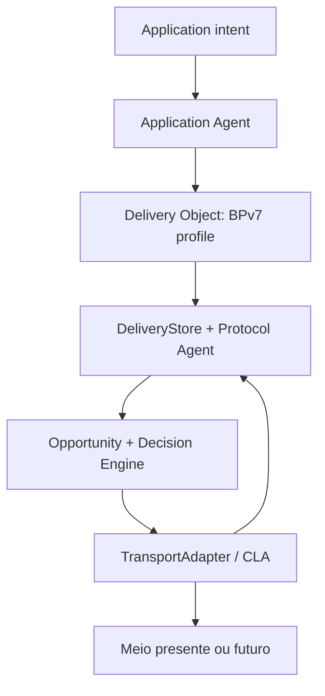

# OpenMesh Architecture v1 — delta após ADR/conformance spike

| Campo | Valor |
|---|---|
| Architecture base | `5b286223175ae249bb292a57222a2835762d25ba` |
| Código auditado | `main@df2dcca20d697cb77bed790d924fe940bd25aaf0` |
| Data de decisão | 2026-08-25 (`America/Sao_Paulo`) |
| Escopo executado | ADRs, conformance, fixtures e documentação; zero runtime |

## Resultado executivo

A Architecture v1 permanece válida como auditoria do estado atual e direção do sistema, com sete refinamentos normativos. A principal hipótese foi resolvida: **BPv7 passa de preferência condicionada a baseline aceito do wire v2**. Isso não entrega licença para implementar o wire imediatamente; a identidade v2 e a integração assimétrica com BPSec permanecem `Experimental`, e interoperabilidade externa é gate.

O OpenMesh não é definido por BPv7. A divisão aceita é:

BPv7 define o objeto/protocolo interoperável. OpenMesh define o contrato de intenção, identidade adicional, verdade persistente, receipts duráveis, avaliação de oportunidades, budgets, energia, explicabilidade, runtime e adapters.

## O que mudou na planta

| Tema da Architecture v1 | Antes do spike | Decisão agora | Documento |
|---|---|---|---|
| Universal Envelope | BPv7 preferido, condicionado a overhead | BPv7 é baseline canônico v2; perfil estreito e gates de interop | [ADR-001](adr/ADR-001-bpv7-wire-baseline.md) |
| Destino e identidade | Separação proposta | Tipos distintos e sem conversão implícita; EID é destino lógico | [ADR-002](adr/ADR-002-identifier-taxonomy.md) |
| Anatomia do objeto | Imutável/mutável/sidecar propostos | Quatro planos por autoridade; policy originada e policy local separadas | [ADR-003](adr/ADR-003-delivery-object-anatomy.md) |
| Store/lifecycle | Máquina de estados conceitual | Objeto, tentativa e receipt são agregados distintos; commit define aceitação | [ADR-005](adr/ADR-005-transactional-delivery-store.md) |
| ACK/receipt | Três níveis sugeridos | Taxonomia normativa; final somente por autoridade do endpoint | [ADR-006](adr/ADR-006-receipt-taxonomy.md) |
| Transport abstraction | SPI proposto | Contrato mínimo aceito; opportunity é observação, não rota; capability tem provenance | [ADR-004](adr/ADR-004-transport-spi-opportunity.md) |
| Identity v2 | Separação recomendada | Separação é invariante; bytes/suite/BPSec continuam experimentais | [ADR-011](adr/ADR-011-identity-v2.md) |
| Governança | Invariantes resumidos | 20 regras normativas e processo de emenda | [Constitution](OPENMESH_CONSTITUTIONAL_INVARIANTS.md) |

## Resultado do benchmark

O perfil BPv7 mínimo ficou +2,553% em 32 B, −2,151% em 64 B e entre −12,710% e −24,525% de 256 B a 10 KiB contra o envelope v1 plaintext. O candidato BPv7+BPSec, embora ainda sem identidade assimétrica equivalente, ficou 15,282%–24,560% menor que o E2E v1 atual modelado.

O achado operacional mais forte é o frame budget BLE: o caminho atual carrega somente 7 bytes de objeto por frame no ATT MTU 23. O perfil seguro de 32 B ocupa 73 frames hoje e 3 na sensibilidade MTU 247. Assim, o risco R4 deixa de ser “BPv7 talvez inviável” e passa a ser “objetos seguros pequenos exigem um CLA BLE medido, com negociação/segmentação/batching apropriados”.

Detalhes, hashes, decomposição e reprodução estão no [relatório](../spikes/adr-conformance/results/BENCHMARK_REPORT.md).

## Correções conceituais introduzidas

### O lifecycle não é uma linha única

`DURABLY_STORED`, `LINK_WRITE_COMPLETED` e `NEXT_HOP_ACCEPTED` são fatos, não necessariamente estados exclusivos do objeto. Um objeto pode manter duas tentativas, conservar uma cópia depois de transferir e receber receipt tardio. A implementação deve separar:

- estado agregado do objeto/entrega;
- estado de cada tentativa;
- receipts/evidências idempotentes.

### “Policy sidecar” não significa esconder toda policy

Restrições locais de energia, custo, transportes e trust ficam no sidecar. Requisitos que um relay precisa honrar — quando realmente necessários — entram em extension block protegido. Um blob `policy` único seria ambíguo e perigoso.

### BPSec default não resolve toda a identidade OpenMesh

BIB-HMAC e BCB-AES-GCM provaram estrutura/tamanho, mas dependem de security associations simétricas. Self-certifying asymmetric origin, content-key encapsulation, rotação e Android Keystore exigem ADR-011 promovida antes de produção.

### BP status report não é custody/commit por definição

O contrato OpenMesh de `NextHopAcceptedDurably` nasce somente após commit do `DeliveryStore`. Ele precisará de administrative record ou sessão autenticada própria; um callback da CLA e um status de reception não ganham essa semântica automaticamente.

## Conhecido, diferenciado e ainda hipotético

| Classe | Conteúdo após as ADRs |
|---|---|
| Tecnologia conhecida | DTN, BPv7, BPSec, CLA, EIDs, store-and-forward, receipts, leases, key separation |
| Aplicação nova de tecnologia conhecida | Perfil BPv7 restrito para Android/BLE; `om1` como mapping singleton legado; receipts ligados ao commit local |
| Arquitetura potencialmente diferenciada | Opportunity/Decision Engine explicável e energy-aware sobre adapters heterogêneos, com uma verdade transacional de entrega |
| Hipótese a validar | Energia/airtime reais, quality das estimativas, namespace/resolução, identidade v2 e interop externa |
| Possível novidade técnica | Nenhuma reivindicada nesta fase; só será considerada após protótipo, comparação bibliográfica e resultados reproduzíveis |

## Gates antes do primeiro writer BPv7 de runtime

- ADR-007 (`DeliveryId`, canonical identity, tombstones e reconciliation) aceita;
- ADR-011 promovida a `Accepted` ou suite marcada estritamente laboratório;
- extension/admin record registry decidido;
- parser limitado, negative vectors e fuzzing;
- round-trip e interop com implementação BPv7 externa;
- threat review do perfil e downgrade;
- benchmark de dois aparelhos com MTU, perda, resume, CPU, airtime e energia.

Até lá, BPv7 continua em `spikes/`, não em source set Gradle.

## Sequência incremental revisada

Cada etapa deve compilar e testar isoladamente; nenhuma depende de “big bang”. A ordem abaixo substitui leituras ambíguas do roadmap original, mas preserva sua intenção.

| PR futuro | Mudança limitada | Prova de conclusão |
|---:|---|---|
| 1 | Renomear evento atual `Forwarded` para `LinkWriteCompleted` com adapter/event compatibility shim | Testes demonstram que nenhum write vira delivery |
| 2 | Introduzir `DeliveryService`/intent API sobre o runtime atual | App chama destino/payload/policy; BLE permanece byte-exato |
| 3 | Definir tipos `EndpointId`, `NodeId`, `TransportAddress` sem mudar wire | Compile-time separation + fixtures v1 inalteradas |
| 4 | Criar contrato `DeliveryStore` e implementação in-memory transacional | Crash/idempotency/lease state-model tests |
| 5 | Adicionar store Android transacional lado a lado, sem migrar ownership | Migration/restart/rollback tests |
| 6 | Criar SPI + fake adapters/opportunities em testes | Adapter failure/isolation/unidirectional tests |
| 7 | Colocar o fluxo GATT atual atrás de `BleTransportAdapter` | Test vectors e teste funcional BLE v1 sem mudança |
| 8 | Fazer `OpenMeshNodeRuntime` possuir store, engine e adapter lifecycle | Serviço continua funcional com BLE off/zero adapters |
| 9 | Migrar dados v1 para o novo store com dual-read temporário | Contagem/hash/restart e rollback comprovados |
| 10 | Implementar receipt taxonomy no modelo/eventos; ainda sem wire final | State/evidence tests e UI não mente sobre delivery |
| 11 | Introduzir Opportunity Engine determinístico simples | Decision traces golden + budgets/expiry |
| 12 | Transformar Wi-Fi Direct em adapter real | Mesmo objeto e store, sem coordinator na Activity |
| 13 | Fechar ADR-007/008/009/010/013 e gates de wire | ADRs/test vectors/benchmarks aceitos |
| 14 | Implementar parser BPv7 hardened em modo read-only/laboratório | Fuzz/negative/interoperability sem emissão v2 |
| 15 | Promover ADR-011 após security spike | Review, vectors, rotation/recovery e Android matrix |
| 16 | Ativar writer v2 dual-stack por feature flag | Highest-version pinning, round-trip e rollback |
| 17 | Adicionar Internet/gateway como segundo meio heterogêneo de produção | Aplicação inalterada usando o mesmo `deliver` |

Nenhum desses PRs está autorizado por este documento. A autorização desta rodada termina na publicação das ADRs e artefatos.

## Riscos após a decisão

| Risco | Estado após spike | Contenção |
|---|---|---|
| Overhead BPv7 | Reduzido; mínimo em paridade/ganho | Manter perfil estreito e medir airtime real |
| Segurança equivalente | Aberto | ADR-011 experimental, review e interop |
| Parser complexo/DoS | Aberto | Limits, negative tests, fuzzing e read-only primeiro |
| Registry privado virar protocolo de fato | Aberto | Faixa privada só em fixture; ADR antes de produção |
| Lifecycle monolítico | Identificado e evitado | Três agregados transacionais |
| Capability spoofing | Modelo definido, eficácia não medida | Provenance/confidence/expiry + observação local |
| Metadata leakage | Não resolvido por BPSec | Minimização e ADR de privacy/traffic analysis |
| Lock-in de identidade v2 | Contido | Não emitir `om2` enquanto ADR-011 for experimental |

## Encerramento desta fase

Entregáveis completos:

1. sete ADRs com status explícito;
2. benchmark reproduzível, JSON/CSV e relatório;
3. fixtures próprias e vetores normativos de conformance;
4. `OPENMESH_CONSTITUTIONAL_INVARIANTS.md` com 20 regras;
5. esta revisão/delta da Architecture v1.

A próxima ação é revisão humana. O trabalho para aqui antes de qualquer refatoração ou implementação estrutural.
