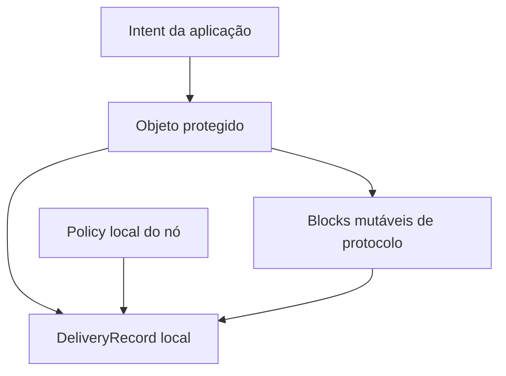

# ADR-003 — Anatomia do Delivery Object

| Campo | Valor |
|---|---|
| Status | `Accepted` |
| Data | 2026-08-25 (`America/Sao_Paulo`) |
| Escopo | Separação entre objeto transmitido, mutações de protocolo e estado/policy local |
| Depende de | ADR-001 e ADR-002 |
| Detalhes ainda abertos | `DeliveryId`/tombstones (ADR-007) e registry dos blocks OpenMesh |

## Contexto

O `MeshEnvelope` v1 mistura no mesmo valor e codec:

- metadados que o E2E autentica (`packetId`, source, destination, timestamps, max hops, priority e content type);
- estado alterado por relay (`hopCount`, `lastHopNodeId`);
- ciphertext/payload e assinatura;
- dados que deveriam existir apenas no nó, como tentativas, retenção e evidência de entrega, hoje mantidos fora ou em memória.

Assinar o envelope inteiro impediria mutação legítima de hop. Não proteger routing permite redirecionamento. Enviar toda policy local vaza preferências e dá a peers autoridade indevida. A separação deve, portanto, ser por **autoridade e lifecycle**, não apenas por classes Kotlin.

## Decisão

O Universal Delivery Object é um agregado com quatro planos separados:

### 1. Objeto protegido on-wire

Contém os fatos cuja mudança altera a intenção ou o conteúdo:

- destination `EndpointId` e source administrativo;
- creation tuple/lifetime;
- ADU ou ciphertext E2E;
- content type/version;
- requisitos originados que relays precisam conhecer e aceitar, em extension block protegido;
- referências de segurança e assinatura/integridade conforme o perfil.

Esses bytes têm canonical form. Mudança exige criar nova identidade/versão do objeto; relay não os reescreve.

### 2. Blocks mutáveis de protocolo

Contêm somente fatos que um hop está autorizado a evoluir, como Hop Count, Bundle Age e Previous Node quando adotados. Cada block tem regra explícita de:

- quem pode alterá-lo;
- monotonicidade e limites;
- comportamento se ausente, duplicado, crítico ou inválido;
- proteção hop-by-hop quando necessária.

O digest de deduplicação não pode depender ingenuamente de todos os bytes mutáveis. A identidade final e canonicalization ficam em ADR-007.

### 3. `DeliveryRecord` local persistente

Nunca é serializado como parte automática do bundle. Contém:

- lifecycle e retenção;
- tentativas, leases, backoff e adapter usado;
- receipts verificados e evidência observada;
- copy budget consumido/restante;
- fragment/segment progress;
- provenance e decision trace;
- tombstone/quarantine quando aplicável.

Receber o mesmo objeto por outro transporte reconcilia neste registro; não cria uma verdade de entrega paralela por adapter.

### 4. `LocalExecutionPolicy` sidecar

Expressa restrições do operador/nó que não pertencem ao objeto remoto:

- transportes permitidos localmente;
- teto de energia e custo financeiro;
- horários, metered/unmetered e background policy;
- trust/admission local;
- quotas, prioridades locais e regras de privacidade.

Ela nunca é aceita de um relay como autoridade sobre o nó. O intent da aplicação pode conter duas categorias: requisitos end-to-end necessários ao processamento remoto, que entram no objeto protegido, e preferências locais, que ficam no sidecar. A API deve tornar essa divisão explícita; “policy” não é um blob único.

## Matriz de autoridade

| Informação | On-wire | Mutável por relay | Proteção | Persistida localmente |
|---|---|---|---|---|
| Destination, source, lifetime, ADU | Sim | Não | E2E/integridade do objeto | Sim |
| Priority/receipt requirement originado | Se necessário aos relays | Não | Extension block protegido | Sim |
| Hop Count/Age/Previous Node | Sim | Sim, sob regra | Validação + proteção adequada ao hop | Sim, na cópia atual |
| Tentativas, leases, backoff | Não | Não aplicável | Integridade do store local | Sim |
| Energia, custo e allowlist local | Não | Não aplicável | Autoridade do operador | Sim/configuração |
| Capability claim remoto | Só em mensagem/registro próprio | Não como “fato” | Autoria, validade e provenance | Cache bounded |
| Receipt | Administrative record separado | Não | Autenticado e ligado ao objeto | Sim/deduplicado |

## Alternativas consideradas

| Alternativa | Problema | Resultado |
|---|---|---|
| Envelope monolítico v2 | Mantém acoplamento de mutabilidade, store e assinatura | `Rejected` |
| Tudo imutável | Hop Count/Age exigiriam novo objeto por hop e quebrariam identidade | `Rejected` |
| Toda policy no wire | Vaza comportamento e permite controle remoto de recursos | `Rejected` |
| Toda policy local | Relays não conhecem requisitos necessários, como receipt/priority acordados | `Rejected` |
| Quatro planos por autoridade | Mais tipos, porém lifecycle e segurança verificáveis | `Accepted` |

## Invariantes atendidos

- Relay não precisa de plaintext.
- Estado local e política do operador não vazam por serialização acidental.
- Metadados que influenciam destino/segurança não mudam silenciosamente.
- Um objeto recebido por BLE ou Internet converge para o mesmo registro.
- Adapter não ganha autoridade sobre routing nem estado durable.

## Consequências e ameaças

- O store não pode guardar apenas um blob; ele precisa de registros transacionais relacionados.
- Extension blocks protegidos exigem regras claras de target BPSec e canonicalization.
- Priority remota é input bounded, nunca direito irrestrito a energia.
- Um relay malicioso pode remover blocks não críticos, congelar blocks mutáveis ou mentir em valores hop-by-hop; o perfil define criticidade, monotonicidade e rejection.
- Metadata leakage continua existindo para dados necessários ao forwarding. Confidencialidade de payload não deve ser vendida como anonimato.
- Sidecars precisam de versionamento e migração local, mas nunca entram no hash/assinatura do objeto.

## Compatibilidade

O envelope v1 é tratado como objeto legado indivisível enquanto trafega em links v1. Ao ingressar em domínio v2, a opção segura é encapsular seus bytes como ADU opaco. Uma tradução estruturada só será permitida se preservar todos os campos e a validade da assinatura em fixtures de round-trip; campos mutáveis v1 não podem ser promovidos retroativamente a fatos E2E.

## Custo de reversão

**Médio antes do schema; alto depois.** A separação pode ser remodelada enquanto permanece conceitual. Depois de persistir sidecars, IDs e blocks, fundi-los exigiria migração on-disk e invalidaria assinaturas. O sentido inverso — voltar ao monólito — também violaria os invariantes constitucionais.

## Classificação de novidade

- **Tecnologia conhecida:** primary/extension blocks de BPv7, separation of concerns e sidecar state.
- **Aplicação nova:** matriz explícita de autoridade entre intent, objeto, relay e política Android local.
- **Potencial diferenciação:** decision trace que reconcilia o mesmo objeto entre transportes heterogêneos.
- **Hipótese:** conjunto mínimo de requisitos originados que precisa realmente cruzar relays.

## Fontes

- [RFC 9171 — estrutura de bundle e blocks](https://www.rfc-editor.org/rfc/rfc9171.html)
- [RFC 9172 — security blocks e targets](https://www.rfc-editor.org/rfc/rfc9172.html)
- [`MeshEnvelope`/codec atual](https://github.com/lucascamilo560-wq/OpenMesh-Mobile/blob/df2dcca20d697cb77bed790d924fe940bd25aaf0/mesh-core/src/main/kotlin/com/openmesh/core/MeshEnvelope.kt)
- [`SecureMeshMessage` e AAD atual](https://github.com/lucascamilo560-wq/OpenMesh-Mobile/blob/df2dcca20d697cb77bed790d924fe940bd25aaf0/mesh-core/src/main/kotlin/com/openmesh/core/SecureMeshMessage.kt)
