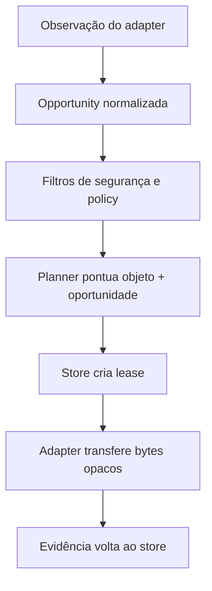

# ADR-004 — Transport SPI e semântica de `Opportunity`

| Campo | Valor |
|---|---|
| Status | `Accepted` |
| Data | 2026-08-25 (`America/Sao_Paulo`) |
| Escopo | Contrato entre runtime/decision engine e meios de comunicação |
| Depende de | ADR-002, ADR-003, ADR-005 e ADR-006 |
| Detalhes ainda abertos | Capability registry (ADR-009), segmentação (ADR-013) e plugin isolation |

## Contexto

`BleMeshNode` hoje combina descoberta, autenticação, GATT, router, retry, store, lifecycle e eventos. O Wi-Fi Direct nasce de uma oferta E2E via BLE, abre sessão TCP autenticada e devolve frames à Activity, mas não participa do fluxo normal do router. Para que Internet, rádio externo ou satélite entrem sem alterar a aplicação, BLE não pode continuar sendo o runtime.

Em BPv7, Convergence-Layer Adapters transportam bundles sobre protocolos subjacentes. O OpenMesh precisa dessa separação e de algo adicional: observações temporárias com custo, direção, confiança e recursos que alimentem um planner. Uma “rota” estática não representa A encontrar B hoje e B encontrar Internet amanhã.

## Decisão

Um `TransportAdapter` é um fornecedor isolável de **observações e transferência de bytes opacos**. Ele não seleciona objetos, não calcula rota, não interpreta plaintext e não decide o significado de entrega.

### Contrato mínimo

| Operação/evento | Responsabilidade | Restrições |
|---|---|---|
| Descrever | Informar identidade/version do adapter e capacidades estáticas locais | Não prometer estado remoto nem disponibilidade atual |
| Iniciar/parar | Adquirir/liberar recursos do meio | Idempotente; falha não encerra o node runtime |
| Observar | Emitir `OpportunityObserved`, `Updated` e `Lost` | Toda observação tem provenance, tempo e expiração |
| Abrir/adquirir | Tentar obter sessão/recurso para uma oportunidade reservada pelo engine | Pode falhar; não escolhe qual objeto enviar |
| Transferir | Consumir byte source/ranges opacos e emitir progresso/resultados de link | Eventos usam taxonomia ADR-006; não emitem `Delivered` |
| Receber | Entregar bytes/ranges + metadata de ingresso ao Protocol Agent | Adapter não persiste nem aceita duravelmente em nome do store |
| Fechar/cancelar | Liberar sessão e permitir preempção bounded | Cancelamento não apaga tentativa/evidência persistente |

Reconciliação, multicast, scheduled contact, resume, custody protocol e parâmetros de rádio entram como extensões versionadas. Eles não incham o SPI obrigatório até existirem dois adapters reais que demonstrem a necessidade.

### `Opportunity` não é rota

Uma opportunity é um fato local temporário: “este adapter parece capaz de avançar bytes neste contexto agora ou numa janela conhecida”. Ela pode não ter peer identificado, pode ser unidirecional e pode desaparecer antes da reserva.

O engine pode usar histórico e contact plans para prever oportunidades futuras, mas uma previsão continua distinta de uma observação atual.

## Capability model mínimo

Capacidade não é um mapa universal de campos igualmente confiáveis. O runtime separa:

| Fonte | Exemplo | Autoridade |
|---|---|---|
| `AdapterDescriptor` local | broadcast, unicast, duplex, MTU/range permitidos | Código/configuração local |
| `OpportunityObservation` | RSSI, peer autenticado, throughput observado, janela | Medição local do adapter |
| `RemoteCapabilityClaim` | gateway diz ter Internet/satélite | Declaração remota; assinatura prova autoria, não veracidade |
| `ResourceSnapshot` local | bateria, thermal, metered, quota financeira | Sistema/operador local |
| Histórico estimado | sucesso, latency, custo energético por byte | Métrica local com decaimento |

Campos comuns mínimos:

- adapter e `OpportunityId`;
- direção (`INBOUND`, `OUTBOUND`, `BIDIRECTIONAL`);
- context/address opaco do adapter;
- peer/endpoint hint opcional e auth state separado;
- `observedAt`, `validUntil` ou janela prevista;
- limites de payload/MTU e suporte a stream/datagram/broadcast;
- estimativas de bandwidth, latency, reliability, energia e custo financeiro;
- infraestrutura requerida e link security;
- provenance, confidence e freshness por valor;
- constraints e extensions namespaced.

`unknown` é valor válido e diferente de zero, infinito ou falso. O planner deve funcionar com informação parcial.

## Autoridade das decisões

| Componente | Pode | Não pode |
|---|---|---|
| Aplicação | Expressar destination, payload e policy | Selecionar BLE/Wi-Fi/Internet |
| Decision engine | Filtrar, pontuar, reservar e escolher oportunidade/cópias | Manipular rádio diretamente |
| Routing strategy | Produzir candidatos/utility usando estado e histórico | Gravar no store fora de transação |
| Store | Autorizar lease, budget e aplicar evidência | Inventar disponibilidade de link |
| Adapter | Observar o meio e mover bytes | Escolher routing, acessar plaintext ou declarar entrega final |

## Semântica de falha e lifecycle

- Cada adapter executa sob supervisão, timeout e circuit breaker próprios.
- Um adapter indisponível remove/expira suas opportunities; o nó permanece `WAITING` ou usa outro meio.
- Restart de adapter não perde o store; leases vencem e são recuperáveis.
- Erro de permissão/radio é estado do adapter, não falha global do node.
- Links sem retorno podem transferir normalmente; acceptance/final receipt volta depois, por outro caminho, ou nunca.
- Uma fila aceita por infraestrutura externa gera evidência específica do adapter, não `NextHopAcceptedDurably`, salvo protocolo autenticado que satisfaça ADR-006.

## Alternativas consideradas

| Alternativa | Benefício | Falha | Resultado |
|---|---|---|---|
| Interface `send(peer, bytes)` apenas | Pequena | Não representa discovery, janela, direção, custo ou lifecycle | `Rejected` |
| Adapter escolhe o melhor objeto | Encapsula peculiaridade do meio | Fragmenta routing e produz decisões inconsistentes | `Rejected` |
| Capability schema exaustivo | Parece future-proof | Prevê rádios inexistentes e congela falsos universais | `Rejected` |
| Um adapter por par de tecnologias | Otimização local | Explosão combinatória e app/core acoplados | `Rejected` |
| SPI pequeno + extensions + opportunity facts | Núcleo estável e evolução incremental | Exige normalização e provenance | `Accepted` |

## Invariantes atendidos

- Aplicação nunca escolhe transporte.
- Adapter nunca decide routing ou entrega final.
- Falha de um adapter não derruba o runtime.
- O nó é válido com zero adapters ativos.
- Unidirecionalidade e disponibilidade futura são first-class.
- O mesmo objeto opaco pode atravessar meios heterogêneos.
- Capability claim remota não vira fato local por estar assinada.

## Segurança e privacidade

- Link encryption complementa, mas nunca substitui E2E.
- O adapter recebe ciphertext/object bytes e o mínimo de metadata necessário ao link; chaves de aplicação não cruzam o boundary.
- `TransportAddress` é tratado como input hostil, adapter-scoped e de lifetime curto.
- Discovery e probes são rate-limited para evitar battery exhaustion e amplification.
- Capabilities têm limites de tamanho/quantidade/freshness; valores extremos são clamped ou rejeitados.
- Peer authentication e link security são dimensões separadas de reliability e trust.
- Adapters in-process não são sandbox de segurança; process isolation para plugins externos exige ADR própria antes de código de terceiros.

## Compatibilidade e extração incremental

1. criar SPI e adapter falso em testes, sem alterar BLE;
2. envolver o fluxo GATT atual em `BleTransportAdapter` preservando bytes v1;
3. mover ownership para `OpenMeshNodeRuntime` e manter facade compatível;
4. integrar Wi-Fi Direct como segundo adapter e provar que a aplicação não muda;
5. adicionar Internet/gateway como prova heterogênea;
6. só então promover extensions comuns observadas em pelo menos dois meios.

## Custo de reversão

**Médio.** O SPI é interno no início e pode evoluir por adapter version/capability negotiation. O custo sobe quando terceiros implementarem plugins; por isso o contrato obrigatório é deliberadamente pequeno e extensions são namespaced.

## Classificação de novidade

- **Tecnologia conhecida:** CLA, interface de driver, opportunistic contact e scheduling.
- **Aplicação nova:** normalização de evidência/custo Android entre BLE, Wi-Fi e gateways.
- **Potencial diferenciação:** planner explicável, energy-aware e delay-tolerant sobre opportunities heterogêneas.
- **Hipóteses:** quais métricas predizem avanço/energia e qual isolamento de plugins será necessário.

## Fontes

- [RFC 9171 — Convergence-Layer Adapters](https://www.rfc-editor.org/rfc/rfc9171.html)
- [`BleMeshNode` atual](https://github.com/lucascamilo560-wq/OpenMesh-Mobile/blob/df2dcca20d697cb77bed790d924fe940bd25aaf0/mesh-android/src/main/kotlin/com/openmesh/android/BleMeshNode.kt)
- [`WifiDirectUpgradeCoordinator` atual](https://github.com/lucascamilo560-wq/OpenMesh-Mobile/blob/df2dcca20d697cb77bed790d924fe940bd25aaf0/mesh-android/src/main/kotlin/com/openmesh/android/WifiDirectUpgradeCoordinator.kt)
- [`WifiDirectDataChannel` atual](https://github.com/lucascamilo560-wq/OpenMesh-Mobile/blob/df2dcca20d697cb77bed790d924fe940bd25aaf0/mesh-android/src/main/kotlin/com/openmesh/android/WifiDirectDataChannel.kt)
