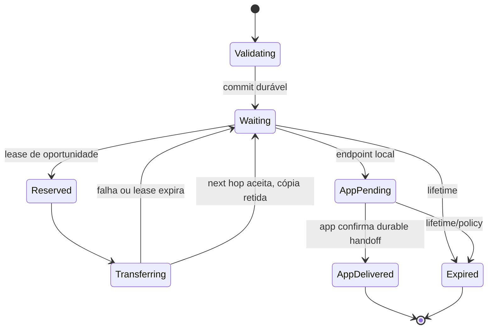

# ADR-005 — `DeliveryStore` transacional e verdade persistente

| Campo | Valor |
|---|---|
| Status | `Accepted` |
| Data | 2026-08-25 (`America/Sao_Paulo`) |
| Escopo | Persistência, atomicidade, recovery, retention e ownership de estados |
| Depende de | ADR-002 e ADR-003 |
| Condiciona | ADR-006, ADR-004 e extração do runtime |

## Contexto

O contrato atual `PacketStore` oferece `contains`, `put`, `getAll`, `remove` e purge. O router executa deduplicação e persistência em operações separadas; o Android grava cada envelope Base64 em `SharedPreferences`. Não há transação conjunta para objeto, lifecycle, tentativa, receipt, lease ou entrega à aplicação.

A sequência proposta originalmente — `VALIDATING → DURABLY_STORED → WAITING → RESERVED → TRANSFERRING → NEXT_HOP_ACCEPTED` e, no destino, `APP_PENDING → APP_DELIVERED` — captura evidências importantes, mas **não deve virar um único enum linear**. Um objeto pode ter várias tentativas simultâneas, uma cópia continuar aguardando depois de um next-hop aceitar e a aplicação avançar enquanto receipts percorrem outra rota.

## Decisão

O `DeliveryStore` é a autoridade local sobre o que o nó sabe. Ele oferece transações atômicas e separa três máquinas de estado relacionadas:

| Agregado | Exemplos de estado/fato | Cardinalidade |
|---|---|---:|
| Objeto/entrega local | `VALIDATING`, `ACTIVE`, `WAITING`, `APP_PENDING`, `APP_DELIVERED`, `EXPIRED`, `QUARANTINED`, `DELETED` | um por `DeliveryId` local |
| Tentativa de transferência | `RESERVED`, `TRANSFERRING`, `LINK_WRITE_COMPLETED`, `NEXT_HOP_ACCEPTED`, `FAILED`, `LEASE_EXPIRED`, `CANCELLED` | zero ou muitas por objeto |
| Receipt/evidência | validado, inválido, duplicado, aplicado, encaminhável, expirado | zero ou muitos por objeto |

`DURABLY_STORED` é um fato emitido somente depois do commit, não uma promessa feita antes da persistência. `NEXT_HOP_ACCEPTED` encerra uma tentativa específica; não encerra necessariamente a entrega.

O diagrama resume o estado agregado; cada transição de transporte possui um `TransferAttempt` próprio. Policies de cópia podem remover a cópia local após aceitação ou mantê-la, mas essa escolha é transacional e explicável.

## Operações semânticas obrigatórias

### Ingestão

Uma única transação deve:

1. aplicar limites baratos e validar estrutura/segurança conforme a ordem segura;
2. calcular/obter a identidade canônica do objeto;
3. verificar objeto existente e tombstone;
4. persistir bytes, metadados indexáveis e estado inicial, ou reconciliar a cópia existente;
5. registrar provenance do ingresso;
6. enfileirar evento/outbox local pós-commit.

Só após o commit o nó pode emitir aceitação durável. Crash antes do commit equivale a não aceito; crash depois do commit deve permitir recovery idempotente.

### Reserva e envio

- O engine cria uma reserva por `(DeliveryId, OpportunityId, adapter)` com lease e budget.
- Concorrência usa compare-and-set/version ou transação equivalente; duas workers não consomem o mesmo budget inadvertidamente.
- O adapter recebe bytes/ranges somente depois da reserva.
- Resultado de link encerra/atualiza a tentativa; receipt remoto pode chegar depois e reconciliar por ID.
- Lease expirado volta o trabalho a elegível sem apagar a evidência da tentativa anterior.

### Entrega local

- Tornar o objeto visível à Application Agent e registrar `APP_PENDING` é atômico.
- Callback disparado não basta para `APP_DELIVERED`. A aplicação ou mailbox precisa confirmar o contrato de aceitação definido; se não oferece durabilidade, o evento honesto é `APP_HANDOFF_UNCONFIRMED`.
- Enfileirar o final receipt e aplicar `APP_DELIVERED` ocorre na mesma transação/outbox, evitando “entregou, mas esqueceu de responder”.

### Expiry, retenção e remoção

- Lifetime do objeto é teto; policy local pode remover antes, mas nunca prolongar bytes expirados como objeto ativo.
- Bytes, receipts, tentativas e tombstones têm retenções distintas.
- Purge é transacional e deixa tombstone bounded quando necessário para replay/dedup.
- Quota considera bytes, quantidade de objetos, origem, endpoint, prioridade, custo criptográfico e admission class.
- `EMERGENCY` não ignora quotas físicas; apenas compete dentro de orçamento reservado.

## Modelo lógico mínimo

Sem congelar schema SQL, o contrato precisa representar:

- `delivery_object`: bytes canônicos, digest/creation tuple, source, destination, lifetime, tamanho e versão;
- `delivery_record`: estado local, retention class, copy budget, próxima avaliação e version;
- `transfer_attempt`: adapter/opportunity, lease, offsets, timestamps, resultado e custo observado;
- `receipt`: issuer, tipo, bytes autenticados, verificação, vínculo e aplicação;
- `inbox/outbox`: eventos durable para Application Agent e receipts;
- `tombstone`: identidade, motivo e expiração;
- `fragment_or_segment`: somente se o contrato futuro exigir resume persistente.

No Android, a implementação esperada é um banco transacional como SQLite/Room, mas o core depende do contrato e de semântica, não da biblioteca Android.

## Alternativas consideradas

| Alternativa | Benefício | Falha | Resultado |
|---|---|---|---|
| Evoluir `SharedPreferencesPacketStore` | Pouca mudança inicial | Sem transações relacionais, leases ou índices robustos; write amplification | `Rejected` para v2 |
| Um enum linear por pacote | UI simples | Perde concorrência, múltiplos next hops e receipts tardios | `Rejected` |
| Store in-memory + log eventual | Throughput | Crash pode transformar aceitação em mentira | `Rejected` |
| Event sourcing integral | Auditoria completa | Complexidade excessiva antes de volume/consulta conhecidos | Adiado, não necessário ao contrato |
| Agregados transacionais + outbox | Verdade recuperável e evolução incremental | Schema/migrations mais complexos | `Accepted` |

## Invariantes atendidos

- Aceitação significa commit durável.
- Crash não promove link write a entrega.
- Uma falha de adapter não corrompe nem derruba a fila do nó.
- Dedup e ingestão não têm janela `contains`/`put`.
- Ausência de oportunidade mantém `WAITING` até expiry/policy.
- Todo consumo controlado remotamente é contabilizável e bounded.

## Segurança, privacidade e DoS

- Validar framing/tamanho antes de CBOR profundo e criptografia; autenticar antes de trabalho caro quando o protocolo permitir.
- Não indexar plaintext E2E. Índices usam metadados mínimos necessários e aceitam que eles ainda vazam localmente.
- Quotas não podem ser burladas criando novos `NodeId`; admission inclui origem não autenticada, endereço/link, custo e rate global.
- Reservas têm leases e owner tokens imprevisíveis/local-only para impedir stale worker commits.
- Receipts e capabilities inválidos são armazenados apenas se úteis para rate/security diagnostics, sob quota pequena.
- Recovery revalida invariantes e não repete efeitos externos sem idempotency key.

## Compatibilidade e migração

1. introduzir o contrato e implementation in-memory em testes, sem trocar BLE;
2. importar cada entrada v1 de `SharedPreferences` idempotentemente para o schema novo;
3. manter marker/migration version e rollback de leitura durante uma release de transição;
4. nunca apagar o store antigo antes de validar contagem, hashes e recovery após restart;
5. tratar v1 como `legacy object` com lifecycle honesto, sem inventar receipts retroativos.

## Custo de reversão

**Alto após a primeira migration on-disk.** O contrato conceitual pode evoluir agora; após persistir objetos, qualquer mudança exige migration forward/backward, compatibilidade entre versões e testes de crash. Separar os agregados reduz esse custo comparado a um enum monolítico.

## Classificação de novidade

- **Tecnologia conhecida:** transações, outbox, leases, idempotência e store-and-forward.
- **Aplicação nova:** modelo de evidência único para tentativas multi-transporte em Android offline-first.
- **Potencial diferenciação:** decision trace persistente ligado a custo/energia por oportunidade.
- **Hipóteses:** volume, índices e retention ótimos em aparelhos reais.

## Fontes

- [RFC 9171 — persistência e processamento de bundles](https://www.rfc-editor.org/rfc/rfc9171.html)
- [`PacketStore` atual](https://github.com/lucascamilo560-wq/OpenMesh-Mobile/blob/df2dcca20d697cb77bed790d924fe940bd25aaf0/mesh-core/src/main/kotlin/com/openmesh/core/PacketStore.kt)
- [`MeshRouter` atual](https://github.com/lucascamilo560-wq/OpenMesh-Mobile/blob/df2dcca20d697cb77bed790d924fe940bd25aaf0/mesh-core/src/main/kotlin/com/openmesh/core/MeshRouter.kt)
- [`SharedPreferencesPacketStore` atual](https://github.com/lucascamilo560-wq/OpenMesh-Mobile/blob/df2dcca20d697cb77bed790d924fe940bd25aaf0/mesh-android/src/main/kotlin/com/openmesh/android/SharedPreferencesPacketStore.kt)
