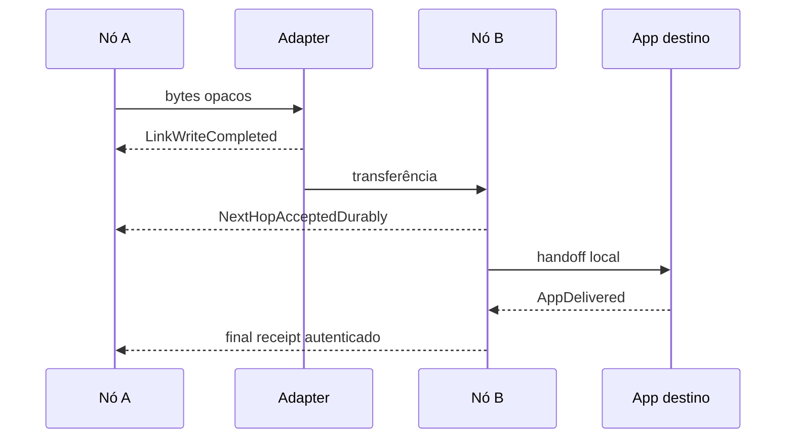

# ADR-006 — Taxonomia de ACK, status e receipts

| Campo | Valor |
|---|---|
| Status | `Accepted` |
| Data | 2026-08-25 (`America/Sao_Paulo`) |
| Escopo | Vocabulário de evidência, autenticação e efeitos no lifecycle |
| Depende de | ADR-003 e ADR-005 |
| Detalhes ainda abertos | Wire de administrative records, chave de assinatura e routing de receipts |

## Contexto

Hoje um write GATT bem-sucedido remove o item do lote por peer e emite evento chamado `Forwarded`. Esse resultado confirma apenas que a API local concluiu a escrita; não prova remontagem, validação, persistência no peer nem entrega final. O Wi-Fi Direct também tem confirmações de sessão/link que não devem ganhar semântica maior.

BPv7 distingue reception, forwarding, delivery e deletion em status reports, mas o protocolo não garante entrega e uma indicação de reception não expressa automaticamente o contrato OpenMesh de commit durável. Além disso, status reports podem causar amplification e são desabilitados por padrão no BPv7.

## Decisão

Eventos e receipts são nomeados pelo fato que realmente provam:

| Evidência | Emissor | Prova | Não prova | Efeito permitido |
|---|---|---|---|---|
| `LinkWriteCompleted` | Adapter local | A operação de link terminou conforme aquele adapter | Peer recebeu, validou ou armazenou | Encerrar fase local da tentativa; nunca marcar entrega |
| `PeerTransferReceived` | Sessão remota, opcional | Bytes/segmentos chegaram e foram remontados | Commit durável | Otimizar retransmissão dentro da sessão |
| `NextHopAcceptedDurably` | Protocol Agent do next hop | Objeto válido foi commitado no store desse nó | Destino final ou app recebeu | Aplicar copy/custody policy daquela tentativa |
| `DestinationStored` | Protocol Agent que serve o endpoint | Objeto foi commitado na inbox do destino | Application Agent consumiu | Aguardar entrega à app ou satisfazer policy que pediu apenas storage |
| `AppHandoffUnconfirmed` | Runtime local | Callback/IPC foi tentado | Processamento ou persistência pela app | Diagnóstico e retry conforme contrato |
| `AppDelivered` | Application Agent/endpoint | Contrato definido de aceitação foi confirmado | Verdade física ou humana sobre uso do conteúdo | Enfileirar final receipt; terminal se policy o exigir |
| `Expired` / `Deleted` | Nó que aplica a ação | Cópia local deixou de ser ativa, com motivo | Falha global da entrega | Retenção/tombstone e status se autorizado |

“ACK” sem qualificador não é nome público aceitável. `Forwarded` pode existir como status BP, mas não substitui nenhum dos fatos acima.

## Verdade observável

Cada seta de retorno afirma somente seu próprio nível. O diagrama não exige caminho reverso simultâneo: receipts são objetos delay-tolerant comuns, podem esperar e voltar por outro transporte ou relay.

Sem receipt final válido, o originador deve reportar `UNCONFIRMED`, `WAITING`, `EXPIRED` ou outra evidência local honesta — nunca inferir `DELIVERED` por ausência de erro.

## Formato semântico mínimo de receipt

Um receipt OpenMesh futuro é um administrative record/objeto protegido que liga:

- versão e domínio de assinatura;
- tipo exato de evidência;
- `DeliveryId`/creation tuple e digest protegido;
- endpoint a que a evidência se refere;
- identidade/role do issuer;
- outcome/reason code;
- momento ou sequence quando relógio confiável não existir;
- ID idempotente do receipt;
- vínculo opcional à solicitação de receipt e ao session transcript para next-hop acceptance;
- assinatura/MAC conforme a autoridade necessária.

Um next hop autenticado pode emitir aceitação durável. Somente uma identidade autorizada pelo endpoint de destino pode emitir final receipt. Relay não transforma um receipt intermediário em final.

## Integração com BPv7

- Status reports BP são preservados com seus nomes e semântica RFC.
- `NextHopAcceptedDurably` é mais forte que conclusão de uma CLA e precisa de administrative record OpenMesh ou protocolo de sessão explicitamente ligado ao commit.
- `AppDelivered` pode ser carregado em administrative record próprio; produção requer decisão de registry. Faixas privadas são apenas para testes.
- Receipts trafegam pelo mesmo `DeliveryStore`, planner e adapters, com prioridade e budget próprios; não dependem de conexão bidirecional atual.
- A ausência de um status report solicitado não prova falha, pois DTN pode atrasá-lo ou perdê-lo.

## Autenticação, replay e fraude

- A assinatura inclui tipo, objeto, endpoint, issuer e versão; mudar `NEXT_HOP` para `FINAL` invalida a prova.
- O verifier resolve a autoridade do issuer de forma distinta da identidade do transporte.
- Receipts são deduplicados e retidos sob policy; replay não reaplica copy-budget nem terminal state.
- Um relay malicioso pode descartar, atrasar ou negar aceitação. Não pode forjar receipt final sem a chave autorizada, mas a criptografia não prova que uma pessoa leu o conteúdo.
- Relógio remoto é evidência, não verdade absoluta. Expiry local usa política de clock definida e tolerância bounded.
- Sessões autenticadas impedem spoofing trivial, mas transcript binding e channel binding são obrigatórios para aceitação de next hop.

## Controle de amplification

- Nenhum receipt é solicitado por padrão só para produzir telemetria.
- A aplicação seleciona nível de evidência desejado; o runtime pode negar política incompatível com recursos.
- Um objeto aceita no máximo a quantidade definida de receipts por tipo/issuer/epoch; duplicatas são descartadas antes de reencaminhamento.
- Receipts têm lifetime, tamanho, hop/copy budget e quota por origem.
- Aggregation pode ser extensão futura, mas nunca deve tornar uma confirmação ambígua.
- Objetos broadcast/group não geram tempestade de final receipts por default.

## Alternativas consideradas

| Alternativa | Falha | Resultado |
|---|---|---|
| Qualquer write = entregue | Falso positivo e perda silenciosa | `Rejected` |
| Qualquer ACK remoto = entregue | Relay pode aceitar sem ser destino | `Rejected` |
| Usar somente status reports BP | Não define commit OpenMesh nem autoridade final suficiente | `Rejected` como solução completa |
| ACK síncrono obrigatório | Exclui links unidirecionais/delay-tolerant | `Rejected` |
| Taxonomia tipada + receipts DTN | Mais estados, mas verdade verificável | `Accepted` |

## Invariantes atendidos

- Link write nunca significa next-hop acceptance ou entrega final.
- Links unidirecionais continuam válidos.
- Aceitação durável só é emitida após commit.
- Apenas receipt autenticado e autorizado do endpoint pode encerrar entrega que exige confirmação final.
- Falta momentânea de receipt não é falha imediata.
- Receipt não escapa de quotas nem ganha prioridade infinita.

## Compatibilidade

O evento atual `Forwarded` será primeiro renomeado/mapeado para `LinkWriteCompleted`, sem mudar o fluxo BLE. Nenhum histórico v1 recebe `NextHopAcceptedDurably` ou `AppDelivered` retroativamente. UIs devem exibir o nível exato de evidência e manter `legacy/unconfirmed` quando não houver protocolo de receipt.

## Custo de reversão

**Médio no código, extremo semanticamente.** Renomear eventos é simples; redefinir posteriormente o que “delivered” significava corromperia métricas, contratos de aplicação e confiança do usuário. A taxonomia é, portanto, constitucional.

## Classificação de novidade

- **Tecnologia conhecida:** acknowledgements, custody-like acceptance, BP status reports e application receipts.
- **Aplicação nova:** vocabulário único e transport-agnostic ligado ao commit transacional.
- **Potencial diferenciação:** evidência explicável que sobrevive a caminhos assimétricos e troca de transporte.
- **Hipótese:** granularidade mínima que aplicações reais precisam sem causar amplification.

## Fontes

- [RFC 9171 — status reports e CLA](https://www.rfc-editor.org/rfc/rfc9171.html)
- [RFC 9713 — Administrative Record Types Registry](https://www.rfc-editor.org/info/rfc9713/)
- [`BleMeshNode` atual e evento `Forwarded`](https://github.com/lucascamilo560-wq/OpenMesh-Mobile/blob/df2dcca20d697cb77bed790d924fe940bd25aaf0/mesh-android/src/main/kotlin/com/openmesh/android/BleMeshNode.kt)
- [`BleMeshGattClient` atual](https://github.com/lucascamilo560-wq/OpenMesh-Mobile/blob/df2dcca20d697cb77bed790d924fe940bd25aaf0/mesh-android/src/main/kotlin/com/openmesh/android/BleMeshGattClient.kt)
